=================================
**Aerial Wildlife Survey Manual**
=================================
---------------------------------------
Aerial Procedures Manual v 0.9 (Uganda)
---------------------------------------

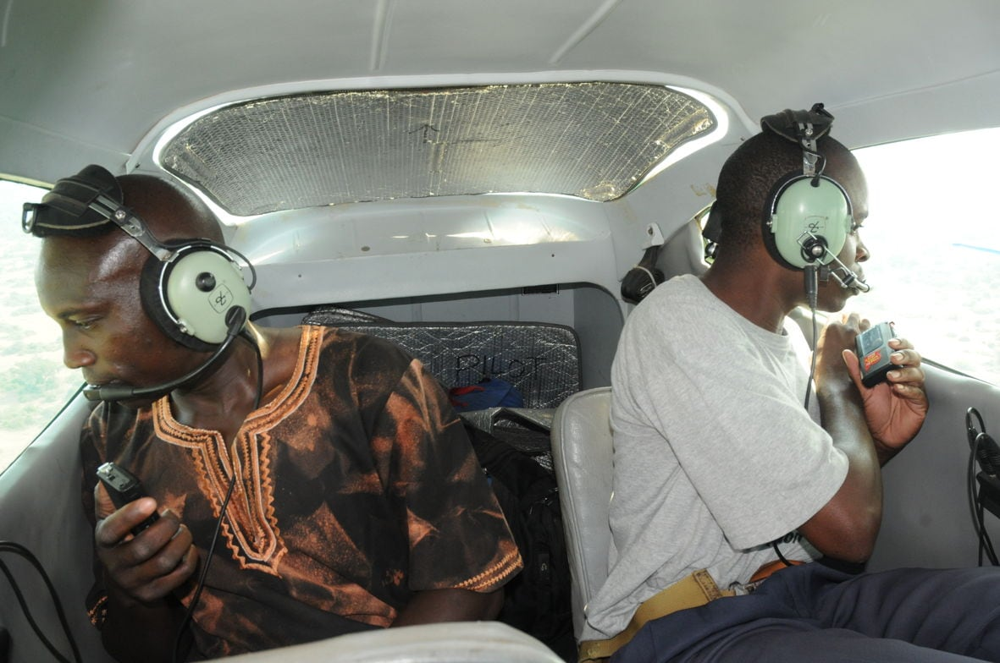

============= =========== =========
|Logo-4-inch| |Logo ICCN| |UWAlogo|
============= =========== =========

Aerial Wildlife Survey Manual

Aerial Procedures Manual v 1.0

With supplementary material for Uganda Wildlife Authority

+------------------------+----------------------+------------------+
| This manual may be     |                      |                  |
| referenced as:         |                      |                  |
|                        |                      |                  |
| **“Frederick, H.,      |                      |                  |
| Moyer, D. and          |                      |                  |
| Plumptre, A.J. (2010)  |                      |                  |
| Aerial Procedures      |                      |                  |
| Manual, version 0.9    |                      |                  |
| (Uganda). Wildlife     |                      |                  |
| Conservation           |                      |                  |
| Society”**             |                      |                  |
|                        |                      |                  |
| *This document and     |                      |                  |
| associated materials   |                      |                  |
| (including software    |                      |                  |
| tools, website and     |                      |                  |
| data) are licensed     |                      |                  |
| under a Creative       |                      |                  |
| Commons non-commercial |                      |                  |
| attributive license.*  |                      |                  |
|                        |                      |                  |
| Temporary site:        |                      |                  |
| **htt                  |                      |                  |
| p://countinganimals.un |                      |                  |
| derdiverwaterman.com** |                      |                  |
+========================+======================+==================+
| |Logo-4-inch|          | WCS Flight Programme | ©WCS 2011        |
|                        |                      |                  |
|                        | Procedures Manual    | Written by       |
|                        |                      |                  |
|                        |                      | Howard Frederick |
+------------------------+----------------------+------------------+

Table of Contents
=================

1 Introduction to aerial surveys 1

1.1 How to use this manual 1

2 Systematic Reconnaissance Flights 3

2.1 Introduction 3

2.2 Planning & Logistics 6

2.2.1 Notifications 6

2.2.2 Equipment list 6

2.2.3 Survey design 6

2.2.4 Budget 16

2.3 Crew 20

2.3.1 Pilots 20

2.3.2 Front Seat Observers 20

2.3.3 Rear Seat Observers 21

2.3.4 Ground coordinators 21

2.3.5 Training 21

2.4 Fieldwork 22

2.4.1 Calibration 22

2.4.2 Transect flights & crew duties 35

2.4.3 Pilot 40

2.4.4 FSO Duties 40

2.4.5 RSO Duties 42

2.4.6 Ground Coordinator 46

2.5 Analysis 49

2.5.1 Data entry 50

2.5.2 Population Estimates 52

2.5.3 Mapping (for UWA) 52

3 Total Counts 55

3.1 Procedure: 56

3.2 Bias in TC 57

3.3 Survey Design 58

3.4 Crew 58

3.4.1 Pilot 59

3.4.2 Front Seat Observer 59

3.4.3 Rear Seat Observers 59

3.4.4 Training 59

3.5 Fieldwork 60

3.5.1 Flying technique 60

3.5.2 Crew Duties 61

3.5.3 Pre-flight 62

3.5.4 Post-flight 62

3.6 Analysis 64

4 Bibliography 65

5 Appendices 67

5.1 Post-service calibration 67

5.2 Appendix B: Online Resources 68

5.2.1 GIS software 68

5.2.2 GPS data upload / download 68

5.2.3 Office software 69

5.2.4 GIS Data 69

5.2.5 Geotagging software 70

5.3 Example transect & flight maps 71

5.4 Counting Photographs 73

5.5 Setting up a camera for fieldwork 74

5.6 Management of GPS route and waypoint in the field 76

5.6.1 Introduction 76

5.6.2 Erase previous block data: 76

5.7 Forms & Checklists 78

5.7.1 Master Equipment Checklist 79

5.7.2 UWA Forms 80

Table of Figures
================

Figure 1: Dual counting strips along flight line. 3

Figure 2: Counts are made in single transect, multiplied up to make
estimate. 4

Figure 3: Example of survey boundary and transects flown. 4

Figure 4: Parallel streamers on Cessna wing strut, and view of strip. 5

Figure 5: Orient transects perpendicular to ecological or density
gradients. 11

Figure 6: Maximising number of samples through transect orientation. 11

Figure 7: Budget tool example. 18

Figure 8: Measurement distances used to calibrate the aircraft. 27

Figure 9: Example calibration data entry. 32

Figure 10: Scanning technique. 45

Figure 11: In or out of the strip - what to count. 46

Figure 12: Total count photographic pass. 61

Figure 13: Transect lines, Luangwa Valley 2008. 71

Figure 14: Actual flight paths, Luangwa Valley 2008. 72

Introduction to aerial surveys
==============================

This is the first version of a manual which will be of assistance in
conducting aerial wildlife surveys. It is intended as a manual of
procedures for use in the field and in the lab, and may be used for
training and reference. This is intended as a ‘living document’ which
will develop over time (either in whole or in part), and comes paired
with an online set of resources. If you find something that needs
expansion, or alternative methods that you find more useful, please get
in touch with us and make suggestions.

*Temporary site:* www.underdiverwaterman.com/countinganimals

We discuss theory of aerial surveys in brief, focusing instead on the
practical application of methods in the field and procedures for running
analyses and working with data. A ‘further reading’ appendix will direct
you to more comprehensive discussions of theory and alternative methods.

This manual describes two commonly-used *aerial direct count* methods.
Direct count techniques rely on observation of visible target animals in
a population, where it is assumed that you *can* see the entire
population; in contrast, indirect methods either do not assume that you
can see the entire population, or rely on other indicators (tracks,
dung) to determine the population size.

**Sample counts**, a subtype here referred to as "Systematic
Reconnaissance Flights" (SRF), involve taking *samples* of part of a
population, and then *estimating* the total population size.

**Total counts** involve an exhaustive search of an entire survey area,
usually counting only one or two species.

|image1|\ How to use this manual
--------------------------------

Some notes on the format:

-  The main text in each chapter discusses principles and theory, in
   brief.

-  Procedures for field and lab are numbered, indicating the exact order
   for each process (see the first example on the right).

-  |image2|\ Code or instrument instructions which refer to text you
   will see on-screen in an application or GPS are in **monotype font in
   blue**.

-  |image3|\ Things you should BEWARE of are in orange-titled boxes,
   labelled “Caution!”. Ignore these at your peril!

-  Tips and hints are indicated in blue-titled boxes (see opposite) with
   “Tips and tricks” or “Hints”. These are intended to make life easier
   for you.

Systematic Reconnaissance Flights
=================================

Introduction
------------

Systematic reconnaissance flights (SRF), also called aerial strip
counts, are sample counts that typically use parallel transects. They
are the most commonly used type of survey in East Africa. The SRF method
was described and widely adopted from Norton-Griffiths’ 1978 “Counting
Animals” (Norton-Griffiths 1978), which used the Jolly II statistics
(Jolly 1969) and developed a standard method for strip transects as
employed in East Africa.

The methods outlined in this manual use the method and calculations as
described in Norton-Griffiths and Jolly, with some small modifications,
which are highlighted in this text.

In SRF, observers count wildlife in *defined counting strips* on both
sides of the aircraft; both strips together make up each transect – each
transect is a single *sample*. Transects are thus flight lines that
cover the entire sample area, and it is assumed that the distribution of
animals between samples is similar to that found in each sample (Figure
2, Figure 3).

Figure 1: Dual counting strips along flight line.

*The objects that lie within the sample area (grey strips) would be
counted, and are indicated in filled circles (red); the objects outside
the sample (hollow circles) are not counted.*

Density is then calculated from:

-  Numbers seen in the strip;

-  Area of strip.

Figure 2: Counts are made in single transect, multiplied up to make
estimate.

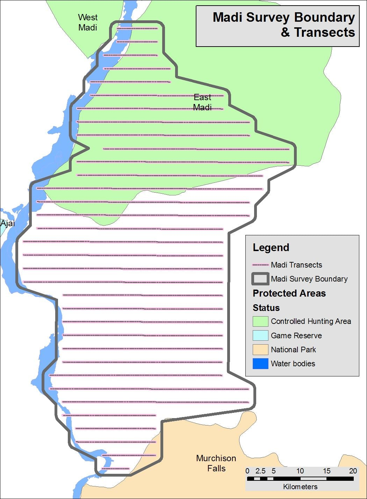

Figure 3: Example of survey boundary and transects flown.

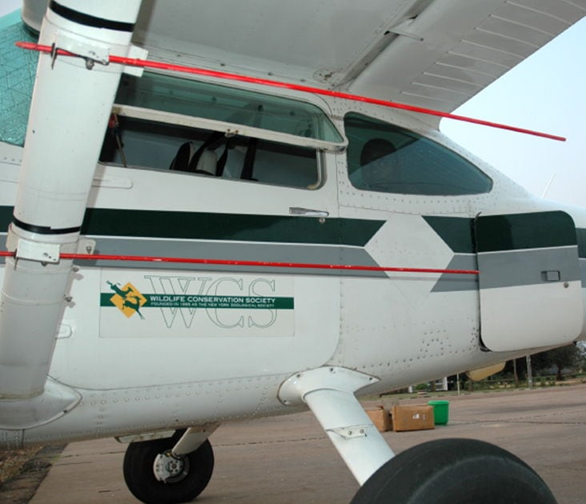

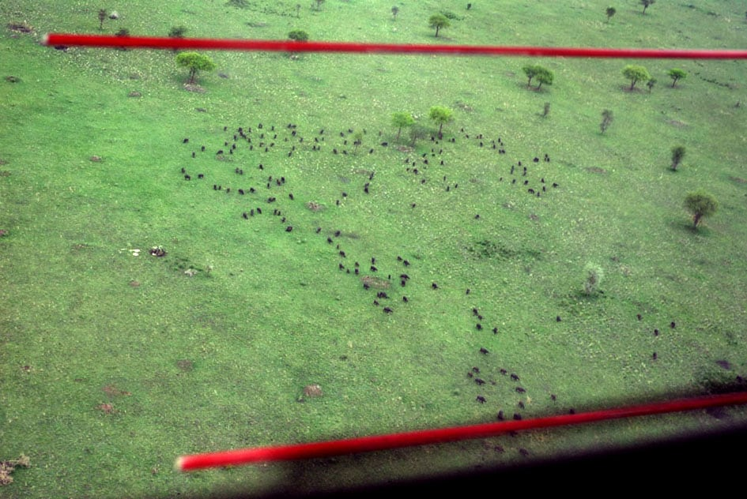

Figure 4: Parallel streamers on Cessna wing strut, and view of strip.

The counting strips on each side of the aircraft are defined by parallel
rods fixed to the aircraft wing struts (the red, straight rods in Figure
4). Observers count only the animals that are seen in between these
rods.

Planning & Logistics
--------------------

Survey planning should begin at least several months in advance.
Aircraft and crew availability should be confirmed as soon as a survey
is proposed, and provisional notification made so that the aircraft
operator and the survey crew can ‘block out’ the time in their
schedules. Draft survey plans, expected outputs and budgets should be
reviewed as early as possible and confirmed.

**Components:**

-  Determination of survey boundaries.

-  Scheduling of crew & aircraft availability

-  Flight & survey permissions & notifications to managers

-  Budgeting (software tool) for money and time requirements

-  Logistics: equipment, fuel, accommodation, ground support, food.

-  Survey design: transect allocation for accuracy and precision.

-  Timing of survey for seasonal limitations and equivalence with
   previous surveys.

Notifications
~~~~~~~~~~~~~

Once schedules are approximately known, it is important to send
notifications to area managers and confirm permissions from authorities.

-  The Civil Aviation Authority and military may require special
   permissions for low-level aerial survey;

-  Protected areas under the management of other agencies than your own
   may require special permission from various offices and these
   permissions should be sought early on.

One step which is often forgotten about is to inform other conservation
actors in the area – researchers with an interest in the ecosystem and
organisations involved in conservation. These other parties are often
very interested in the conduct and outcome of these surveys, and may be
able to offer valuable advice as to planning or even fundraising.

Equipment list
~~~~~~~~~~~~~~

See Appendix (section 5.7.1.) for the master equipment list. This should
be reviewed at least one month before the survey. In particular you need
to confirm access to specialised equipment such as the streamers and GPS
units.

Forms, general stationery and other equipment should be again reviewed
and prepared one to two weeks before the crew is to depart to the field.

Survey design
~~~~~~~~~~~~~

In many cases a survey design will already exist, and the same survey
plan has been flown many times before. It may be necessary to redesign
some surveys or survey entirely new areas, so this section covers the
principles of basic survey design and layout of transects.

There are several main considerations:

-  Survey boundaries: what area are we interested in? Has it changed
   from the past?

-  Financial: how much money is available? This is unfortunately usually
   the main limiting factor.

-  Time: when should the survey be scheduled? How much time is available
   to complete it once started? It is important to finish a survey
   quickly so that changes in ecological conditions and animal movements
   are minimised.

-  Aircraft and crew availability: the number of aircraft available for
   a large survey area is extremely important, and the likely
   availability of aircraft must be researched early on (see Aircraft,
   2.2.4.1)

-  What species populations are being estimated? If a previous design
   has been used, were the errors around estimates very large? If so it
   may be better to redesign the survey.

Caution!

-  Good survey design can save a huge amount of time and money, and bad
   survey design can give you entirely inappropriate results. Though the
   instructions here attempt to be complete, it is worthwhile passing
   any survey design by a statistician or specialist in surveys.

-  Here, we present some basic principles of designing a sample count.
   For a more complete discussion of the theory behind sample counts,
   read Norton-Griffiths (1978), Jachmann (2001) and review the
   suggested literature in the Bibliography (section 5.4).

Basic principles
^^^^^^^^^^^^^^^^

1. You should attempt to have *a minimum of 20 transects* in a given
   survey block or stratum, and better yet 30 or more.

2. In general, the more transects you have, the greater the precision
   you will have, but there is a principle of ‘diminishing returns’
   above a certain point. Jachmann (2001) notes that with elephant
   sample counts, greater than 10% coverage (area sampled compared to
   whole survey block) gives very little added benefit; one should try
   to have more than 5% coverage.

3. Transects should cut across ecological gradients or gradients of
   known wildlife density (Figure 5).

4. Stratification into ecological zones and density areas may greatly
   enhance the precision of the final result. Stratification however can
   rarely be made for more than one species in any survey design, unless
   they tend to be found in the same habitats.

Terminology

-  Intensity: the amount of work that goes into a sample count – refers
   to *more transects* and/or *a greater percentage of area sampled*.
   Note that those are NOT necessarily the same thing (Figure 6)!

-  “Coverage” usually refers to the percentage of area sampled (total
   strip width) divided by the total area. Most surveys use 5 to 10%
   coverage, though lower (1%) and higher (20%) are seen. This is a
   direct function of strip width and spacing between transects.

-  Home base: this is where the aircraft is based when it’s not on
   surveys with you (i.e. Kampala, Iringa (Tz), etc.).

-  Field base: the airstrip in the field where the aircraft operates
   from.

-  Ferry: the trip from home base to the field base.

-  Transect: the actual flight line flown while counting animals.

-  Transit: the ‘dead time’ from the field base to the beginning of the
   transect.

-  Dry cost: the hourly cost of flying an aircraft *excluding* fuel –
   maintenance, insurance, etc. This is usually quoted by the operator.

-  Wet cost: the hourly cost of flying an aircraft in total, all
   inclusive. Operators will often charge a fixed ‘positioning’ fee on
   top of this.

Delineate survey boundaries
^^^^^^^^^^^^^^^^^^^^^^^^^^^

This is the first stage of examining an area: what area do we want to
look at, why, and what are we expecting to find? It is extremely
important to use *local knowledge* of the survey area to design the
boundaries – a protected area ecologist, warden, researchers with long
experience of the area.

-  Previous surveys may have been done in the area, and you should
   review the history of surveys and wildlife in the area.

-  What are the target species? Where are they found?

-  Were previous survey boundaries adequate? Often survey reports will
   indicate if the *next* survey should include other areas, or exclude
   them – this is a message for *you* as the next survey designer!

-  Have ecological conditions changed, warranting a change in the survey
   area? Wildlife may be known to have reduced or extended its range, or
   agriculture may have taken over a large part of the area.

-  Does the survey adequately cover protected areas?

-  Are there special requests from donors, researchers, or wardens?

Once you have an idea of the above questions:

1. Draw the survey boundaries.

2. If the survey covers a protected area, ensure that a buffer is
   included around its boundaries (2-5 km).

3. Calculate the area using GIS software or on paper.

Determine survey intensity and strata
^^^^^^^^^^^^^^^^^^^^^^^^^^^^^^^^^^^^^

Stratification of a survey area involves dividing the survey area into
zones of different survey intensity – this may be done to increase
accuracy (focussing on areas of higher animal abundance) or for
reconnaissance of previously unsurveyed areas, for example.

Surveying areas of higher abundance at a higher intensity and vice-versa
maximises the value of your time and money. Jachmann (2001) suggests
that a difference of density by a factor of three makes it worthwhile to
consider stratification; however, he also notes that the spatial
variation in density between species is never constant, and one species’
stratification may not be suitable for another.

Dividing the survey area into ecological or other units that are sampled
individually can make for a more manageable survey. This typically means
survey blocks of 4-5,000 km\ :sup:`2`.

Transect spacing is often made to fit the UTM grid – 1 km, 2.5, 5, 10 or
20 km spacings are typical. This is dependent on the available budget
and the number of transects needed.

Transect orientation
^^^^^^^^^^^^^^^^^^^^

In a survey block (or stratum), transect orientation describes the
*direction of flight* of the aircraft – i.e. north-south, east-west, or
125°-305°.

Most surveys have traditionally used an east-west or north-south
orientation, for ease of navigation and sometimes to enable easy
assignment of observations to UTM grid squares.

Transect orientation should be thought about carefully, and the
following rules and illustrations show why:

-  **Orient transects east-west unless you have a good reason to do
   otherwise:** flying east-west means that the pilot and FSO face the
   sun on alternating transects, but not the rear seat observers. This
   is important to improve visibility by the RSOs. A non-east-west
   transect would cause problems:

   -  One RSO would always have the sun in their eyes;

   -  Even minor glare on an old Cessna window usually makes it fog up
      badly, also reducing visibility;

   -  Animals often stand in the shade of trees, and on a north-south
      transect they would always be hidden or the observer would be
      looking into the deep shade (in contrast, flying east-west would
      give a chance to see the animal in profile).

-  **Transects should cut across ecological or density gradients:**
   precision partly relies on having the same number of animals in every
   transect, so it is better to sample from one density to another in
   *each* transect, if possible (Figure 5).

   -  If you have old survey data, you can plot the density of animals
      across the survey area and look for patterns.

   -  During the dry season, rivers and other water bodies almost always
      create gradients from low (dry) to high (wet) areas; in the
      absence of other information, *plan transects to cut across rivers
      and wetlands*.

-  **Maximise the number of samples by drawing them perpendicular to the
   long axis of the survey area:** this has a big effect on a long
   narrow survey zone (Figure 6).

-  **In areas of strong wind, the transects should be laid out to fly
   parallel with the prevailing winds.**

   -  A strong crosswind causes the plane to ‘crab’ (fly at an angle)
      and this is both tiring for the pilots and causes the strip to be
      increased by *an unknown amount*.

   -  It may be better to simply choose times of day or of the year with
      less wind, as flying in strong winds will also change your ground
      speed beyond controllable levels.

      *On a recent WCS survey in Malawi, the aircraft was forced to fly
      at a ground speed of 240 km/h on the downwind legs (with full
      flaps), and could manage no more than 150 km/h on the upwind (no
      flaps and full power!). A ground speed of 150 km/h is a nice
      leisurely pace to see everything, but 240 km/h is far too fast and
      observations are missed.*

Caution!

-  Ensure that the ecological conditions you are using to design
   transect layout and stratification are current for the *season* when
   you plan to survey, and are recent enough to be valuable (don’t use
   data from twenty years ago without having a good look at possible
   changes).

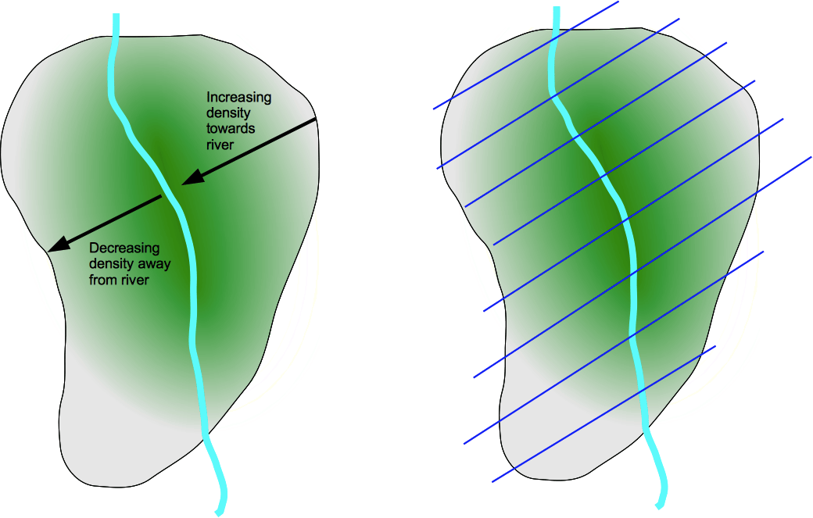

Figure 5: Orient transects perpendicular to ecological or density
gradients.

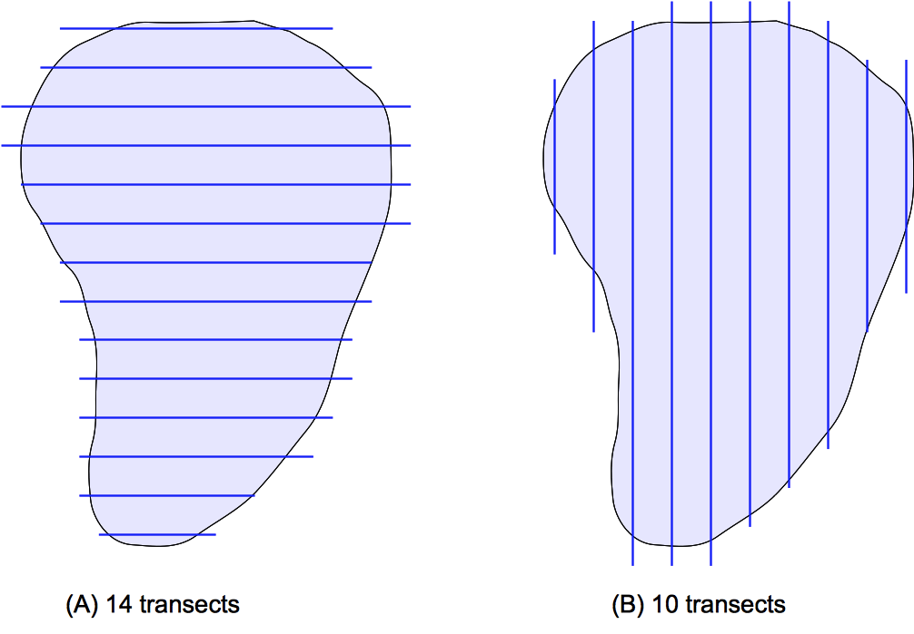

Figure 6: Maximising number of samples through transect orientation.

*Note that the transect length and sample area should be about the same
in both cases, but the number of samples is increased.*

Allocate transects & create draft flight plans
^^^^^^^^^^^^^^^^^^^^^^^^^^^^^^^^^^^^^^^^^^^^^^

Transects are allocated before the survey begins; flight plans are
usually worked out on a day-to-day basis with the pilots, but advance
planning can, again, be very valuable in terms of time and resources.

In brief, transects are laid out using a GIS system and data:

-  For each survey block, draw a ‘baseline’ perpendicular to the
   orientation of the transects.

-  Transects are laid out perpendicularly to this baseline on a
   *regular* interval, either geographic (lat-lon) or UTM (metres).

-  Though the interval between transects is regular within a block, the
   starting point may be chosen randomly or alternatively from an even
   coordinate.

-  Start and end points are selected from one edge of the survey area to
   the other.

Standards for transects:

-  Transects should take no more than 45 minutes, ideally no more than
   30. Long transects (>45 minutes) may be broken into smaller pieces;
   this may be done at natural features such as hills, or even rivers,
   *if* the rivers are wide enough to be a barrier to animal movement.

-  Check the terrain: strongly undulating terrain or mountains is
   difficult or impossible to fly over, and may have to be excluded.
   Review with a pilot. Large areas of difficult terrain that may still
   be flown should either be counted as a block count or at least
   sampled and analysed as a separate stratum.

The following instructions are one way of allocating transects along
systematic UTM lines, as per the method used by Uganda Wildlife
Authority (UWA) and WCS Uganda. QGIS instructions are included here as
it is a free package that can do everything required; ArcGIS will also
work well. For this example a set of transects will be placed on the
Madi area using UTM zone 36 (example data available on the website), for
east-west transects at 5 km spacing, and 2.5km between subunits.

**Prepare QGIS with the correct plugins:**

1. Start QGIS and ensure you are online;

2. Select Plugins: Fetch Python Plugins

3. Go to the Repositories tab and click “Add 3\ :sup:`rd` Party
   Repositories”, then OK. The plugin list will load from the online
   sites.

4. Go to the Plugins tab and type fTools in the Filter box. Select
   fTools from the list and click Install/upgrade plugin to install it.

5. You will now have a new menu called Vector with a set of really
   useful tools for editing and processing the map – these are used
   below to generate a grid and extract properties from the map.

**Digitise transects and create endpoints:**

1.  Open QGIS.

2.  Set the project properties to UTM:

    a. **File:Project Properties…**

    b. **Coordinate Reference System** tab: enable “\ **on the fly
       CRS**\ ”, and select “\ **WGS 80 / UTM zone 36N**\ ” in the list.

    c. Click **OK**.

3.  Add the map of your survey area:

    a. Click |image4|\ **Add Vector Layer**, **Browse** to select the
       .SHP file, and click **Open**.

4.  Make sure the added layer is displaying correctly; you must know
    what its datum was, and set it:

    a. Right-click on the shapefile in the “\ **Layers**\ ” list on the
       left, and select **Properties**;

    b. Select **General** from the list on the left, then click
       **Specify CRS**. In this example I know that my shapefile is in
       Lat-Lon WGS84, and I select this from the list, then press
       **OK**.

    c. Press OK to confirm the layer properties.

5.  Zoom to the layer: click |image5| or right-click the layer and
    select “\ **Zoom to layer**\ ”.

6.  Add a buffer if necessary (if your shapefile does not already
    include one):

    a. **Vector: Geoprocessing Tools: Buffer(s)**

    b. Indicate the buffer distance in metres (i.e. 2500);

    c. Choose a filename and location;

    d. Click OK and then accept addition of the buffer to the view.

7.  Determine the E-W and N-S extents of the survey boundary:

    a. Y Max: Position the mouse over the northernmost edge of the
       survey boundary and read the second (Y or northing) number in the
       **Coordinates** box at the bottom of the screen. Round this up to
       the nearest multiple of 10,000 – i.e. if you get 442,000 make
       Y-Max = 450,000.

    b. Y Min: do the same at the southernmost edge, but round *down* –
       i.e. if you have 394,200 make this 390,000.

    c. X Max: do the same for the easternmost edge, and round up;

    d. X Min: do the same for the westernmost edge, and round down.

8.  Create a regular grid of points:

    a. Select **Vector: Research Tools: Regular Points**

    b. Click the **Input Coordinates** radio button then enter the
       values from the last step in the labelled boxes.

    c. Select a **spacing value** (in metres) – we want to have subunits
       (east-west) on a 2.5 km interval, and will use this as the
       minimum as the 5km spacing is a multiple (if you pan to use a
       different, non-multiple spacing, a different method will have to
       be used, as QGIS does not allow for different X and Y spacing
       values).

    d. Click **Browse** and choose a location and name for the file,
       e.g. **Madi_points**.

    e. Click **OK** then confirm to add the new layer to the view.

    f. Right click the new layer and select **Properties**, then
       **Symbology** and change the symbol size to 1 (or as required to
       make it display nicely). Press OK.

9.  Set ‘snapping’ so that created lines will line up exactly with your
    grid.

    a. **File: Document Properties**, select the **General** tab, then
       **Snapping options**.

    b. Tick the box next to the point layer, then select a **Tolerance**
       – I suggest 8 pixels (change this from ‘\ **map units**\ ’) (the
       higher the tolerance, the further away from the point the cursor
       will ‘snap’).

    c. Click **OK**, then **OK** to return to the map.

10. Make a new shapefile for the transects.

    a. **Layer: New: New Shapefile Layer** …

    b. Choose ‘line’

    c. Choose the **CRS** (UTM zone 36N, WGS 84),.

    d. Add one attribute: **Name** “Transect”, **Type** “Whole Number”,
       then click Add to Attributes list.

    e. Choose name for the file and location (**Browse**)

    f. **OK**

11. Edit and digitise the transects.

    a. Right-click and select **Toggle Editing**.

    b. Click a point to start each transect, and right-click to stop at
       the end.

    c. Draw the lines from point to point, starting and ending at the
       closest points in line that are just outside the survey zone.
       Click *close* to the points (within the 8 pixels (screen dots) as
       suggested above) and they will line up exactly. If they look out
       of line, redo the line (control-Z to undo).

    d. Each line will now be a multiple of 2.5km long; make sure that
       you select lines that are 5km apart, though.

12. Calculate transect numbers:

    a. Right-click the layer and select **Open Attribute Table**.

    b. You should still be editing, but click **Toggle Editing Mode**
       (pen icon) below if not;

    c. Click the calculator icon to bring up the calculation window;

    d. Select “\ **update existing field**\ ” and confirm **Transect**
       is selected;

    e. Click the **rownum** button, then type “\ **\* 10**\ ” in the
       **Field Calculator Expression** box just after the rownum text.

    f. **OK**

13. Calculate transect lengths

    a. Click the calculator icon to bring up the calculation window;

    b. In the “\ **Output field name**\ ” enter “Length;

    c. Click the **length** button, then type “\ **/ 1000**\ ” in the
       **Field Calculator Expression** box just after the length text
       (this calculates the length in kilometres instead of metres).

    d. **OK.**

14. Stop editing (click **Toggle Edit** button again) and confirm to
    save the file.

15. Make a layer with start and end points:

    a. Select **Vector: Geometry Tools: Extract Nodes**

    b. Select the name of the transect layer, then Browse to select the
       name of the point layer you will create. Click OK.

At this point you have a transect shapefile and an endpoint shapefile
which may be uploaded to a GPS (see the section on GPS data, 5.6).

Tips

-  Before spending too much time on allocation of transects in your
   survey blocks, consider the next section on budgeting. Having
   calculated the survey intensity in the previous section, and thus the
   total flying hours, lets you do more accurate financial planning; it
   may be that you have to go back to previous steps if your budget is
   limited, or even if it turns out that you have a budget sufficient to
   cover a wider area!

-  Using an even-number starting point in UTM or Lat-Lon can make it
   easier for the pilot to navigate.

-  If you want to start on a different N-S point, select a different
   Y-Min (southernmost) point and QGIS will calculate points starting up
   from there.

-  If transects are numbered with multiples of 10, you can add
   additional adjacent transects in between or at the ends of other
   transects and give them similar names, i.e. 11, 15. This is
   especially useful when you have to *break* a transect and fly the
   remainder on another day. As it becomes a *separate sample*, it needs
   a separate number!

   When learning about statistical sampling, you may have had it drummed
   into you by lecturers that one should try to do *random* sampling,
   choosing plots and transects at random locations across the area of
   interest – why, then, do we here suggest laying out systematic
   transects on set intervals?

   Random sampling is meant to remove biases caused by prior selection
   of survey areas – to stop the way in which we choose samples from
   affecting our results. *Systematic* sampling, relative to distances
   along a baseline, is still *random* with respect to the distribution
   of wildlife! Unless, of course, the animals are somehow lining
   themselves up with latitude/longitude lines … this could conceivably
   happen if there are human landscape features on the same grid, such
   as roads or fences, but this is very unlikely.

Subunit Allocation
^^^^^^^^^^^^^^^^^^

The following instructions again rely on the plugins installed
previously.

1. Ensure you have your transect and 2.5km grid loaded, as in the
   previous examples.

   a. If not, add them (|image6| **add vector layer** button) (e.g. Madi
      Points and Transects from the example above).

2. Make a new shapefile composed of the points that intersect your
   transects, and that have the number of the transect included:

   a. Intersect tool: **Vector: Geoprocessing Tools: Intersect**

   b. The **Input vector layer** should be the points layer;

   c. The **Intersect layer** should be the transect layer;

   d. **Browse** to select a new shapefile name.

   e. Click OK, and confirm to add the file to the view.

3. This subunit file may be uploaded to the FSO GPS to show the edges of
   subunits.

Caution

-  These instructions work for setting up a new survey area. In Uganda
   many survey zones already have survey boundaries and subunits
   allocated.

Budget
~~~~~~

In a perfect world, we would have an unlimited amount of money available
to do our wildlife surveys – in this case we would look at the desired
survey intensity and area and simply submit a budget. In reality this
usually happens the other way around, or becomes a process of
negotiation. It is often necessary to come up with a rough survey plan
and budget, then go back to donors or financial managers and figure out
might be possible, then go back and trim or expand your initial survey
plan on that basis.

The details of organisational budgeting are beyond the scope of this
manual (though this is a section that should be developed), as are the
details of field budgets for the various protected areas. However, the
largest part of a survey budget is almost always the aircraft, crew and
fuel, and this manual presents a budgeting tool for development of
survey costs estimates.

It is possible to do basic budgeting with the following information:

1. Target survey area size;

5. Average survey intensity (if you are stratifying, this is the average
   for the whole survey area);

6. Fuel costs per litre and/or hourly costs for aircraft;

7. Aircraft home base and field base positions;

8. Crew costs per day.

Aircraft
^^^^^^^^

Use the “SRF Budget Tool 0.1.xlsx” from the Counting Animals website or
the CD included with this manual.
http://countinganimals.underdiverwaterman.com

Things you must know to get a decent estimate:

-  Transect kilometres to be flown = |image7|\ |image8|

-  Fuel cost per litre, and cost of getting fuel to the site.

-  Aircraft cost: if you are quoted a “dry” cost (without fuel), you
   still need to figure out fuel; if you are quoted a “wet” cost, fuel
   *cost* is included and is not a consideration BUT you still need to
   plan for the number of drums needed on site and their transport costs
   to the site.

-  Home base location for aircraft and location of field bases.

Instructions: each number (after 0) here refers to the label on the
spreadsheet (1-13):

1.  Open the spreadsheet tool (this works in both Excel and OpenOffice).

    *As with other software tools, the cells highlighted in green are
    the variables you should fill in and change. In this case, the
    bright green cells are the ones which have a very large impact on
    the final cost; the cells in darker green have less of an impact but
    are still important to fill in properly.*

2.  If the aircraft provider has given you a dry cost, enter this here.
    If there is no per-hour cost for the aircraft, enter 0.

3.  Fuel consumption is typically 55 litres/hour for a Cessna 182 and
    65/hour for a Cessna 206; check with the provider, as it may vary
    considerably from this.

4.  The number of aircraft available has an enormous impact on the cost
    and time required. Enter the likely figure, then play by increasing
    or reducing it – it is often surprising just how much this affects
    the final numbers!

5.  Fuel cost (in USD) per litre, excluding positioning costs. If you
    have been given a wet cost (fuel included in aircraft cost), put 0
    here.

6.  How far is it for the aircraft to come from home base to the field?
    This will probably be given to you by the operator, but can be
    estimated off the map.

7.  How many km of transects are likely to be flown? Divide the *survey
    area* by the *average spacing*. It’s a good idea to add a bit (20%)
    if you are unsure about spacing in the case of stratification.

8.  How long is a typical transect? Measure this on the map or from old
    survey reports.

9.  How long does it take to turn the aircraft at the end of a transect?
    This is a minor effect and can be left at 2 minutes.

10. How long does it take to go from the field base (airstrip) to the
    beginning of transects? The easy way to estimate this is to draw a
    line two-thirds of the way to the survey boundaries from each field
    base, and take the average from north, south, east and west
    directions. Divide this average distance (in km) by 180 (the speed)
    and multiply by two (for return flight) to get this average transit
    time.

11. Flying speed should be 180 km/h on average.

12. How many hours per day will be spent *actually counting animals*?
    This is the transect flying time excluding transit, i.e. the amount
    of time the RSOs are counting. This should NOT exceed 5.5 hours
    (e.g. 3 in the morning, 2.5 in the afternoon), and is often
    realistically about 5 hours.

13. Positioning time is the amount of time required before and after the
    survey for getting the aircraft into position; this means added days
    of crew fees.

14. What is the cost of the pilot, per day? This may be an allowance or
    other fee (local currency).

15. What is the observer (FSO / RSO) fee per day (local currency)?

16. What is the USD rate?

After entering or checking all of these numbers, the system gives you
some really important numbers! These are listed in order as they are
found on the sheet (see example in Figure 7), with the most crucial
figures highlighted in boxes:

-  **Survey days**: how many aircraft-days will actually be spent
   surveying, total?

-  **Work days**: This previous figure is aircraft days so if you have
   more aircraft, this is the number of days that will be actually
   worked in the field.

-  **Rest days**: assuming 4 days working / 1 day off (a good assumption
   and rest days should always be planned anyway), how many ‘down’ days
   are there?

-  **Total time on survey**: this is the total amount of time estimated
   to have the team and aircraft in the field.

-  **Total km**: total of all survey km flown (operators may ask for
   this for budgeting).

-  **Ferry**: km to send aircraft back and forth to home base.

-  **Hours**: total flying hours for the aircraft, from the time they
   leave home to the time they return (i.e. including ferry, transit and
   transect flying).

-  **Fuel**: the number of litres of fuel needed for the whole project.

-  **Drums**: assuming 200L drums of fuel, this is how many you should
   need.

-  **Pilot / observers**: the number of person-days you’ll need to feed,
   water and accommodate the crew.

-  **Crew**: the USD cost of the crew (pilots + observers) for the
   entire survey, including positioning time.

-  **Fuel**: the exact USD cost of fuel used (if you are using drums,
   multiply the drum cost times the number of drums instead).

-  **Aircraft dry cost**: based on the number of hours, the cost of the
   aircraft excluding fuel.

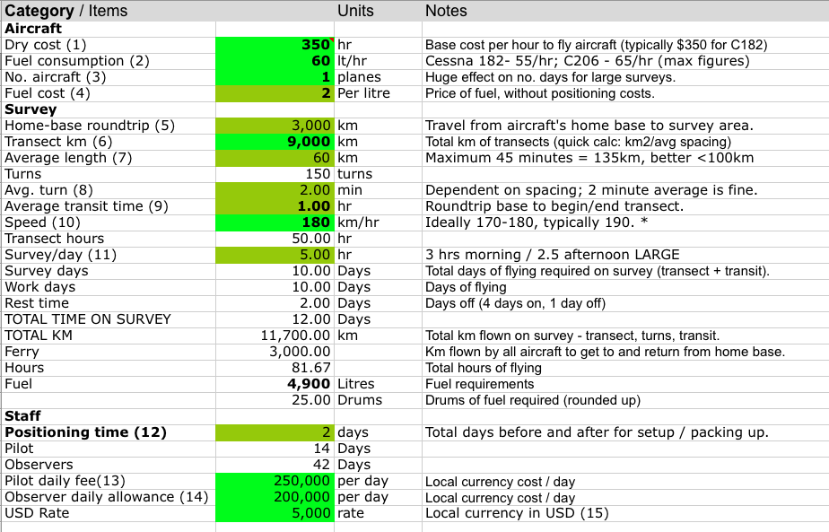

Figure 7: Budget tool example.

Caution!

-  These figures must, as always, be looked at carefully to see if they
   are realistic. What did previous surveys cost? Are there conditions
   that don’t apply to this sheet?

-  It is worthwhile adding a contingency fee of at least 20% to the
   final estimate.

-  Aircraft maintenance intervals can add a lot of cost: ferry flights
   back to home base, extra down days for crew in the field, etc. This
   is NOT included in this estimate, and for a large survey extra ferry
   and ‘positioning’ costs should be estimated more accurately.

Time
^^^^

The estimates for time in the field should now be considered together
with the availability of crew and aircraft and the seasonal requirements
for doing the survey.

Other costs
^^^^^^^^^^^

There are many other considerations for planning a survey which are not
included in detail in this manual. A brief checklist follows:

1. Fuel positioning costs: how will you get fuel drums to the field
   bases? Is there a fuel drum deposit cost?

2. Food and accommodation for crew and ground staff.

3. Security for aircraft from the elements and/or theft.

4. Power for laptops.

5. Batteries for GPS and other equipment – it is usually worth buying a
   good set of rechargeable batteries; they pay for themselves within a
   couple of weeks and reduce waste in the field.

Crew
----

Experience and diligence are extremely important in proper conduction of
any scientific enterprise, and this is no exception. Consistency of
method is vital for accuracy and for analysis of long-term trends, and
each member of the crew must meet certain standards.

Selection of experienced and capable staff is vital – it is important
for the entire crew to function well together and for the data produced
to be reliable and properly recorded. Pilots must be able to fly the
transect plan with good height and speed control, RSOs must be able to
recognise all the species in the target area, have good vision and
endurance, and FSOs must be able to accurately and reliably record
height data and assist the pilot in navigation.

However, it is also important to balance the need for experienced staff
with the need to give experience to junior staff, and to involve the
ecological staff of a given protected area in surveys. Accordingly it
may be necessary to allocate extra time for training, both on the ground
and in the air.

Pilots
~~~~~~

The pilot is responsible for flying the aircraft, navigating to, from
and along transects, and for the safety of the crew.

A commercial license is not necessarily a legal requirement for survey
flying, depending on the status of the aircraft. However, a pilot should
have a minimum of:

-  200 hours of PIC (pilot in charge) hours logged;

-  20 hours of survey flying at low level, with a proven ability to
   maintain 350 feet a.g.l. and keep ground speed at or near 180km/h
   even with a moderate tailwind.

Where the pilot does not have sufficient survey flying experience,
he/she should be paired with an experienced pilot who can act as FSO and
assist and train the primary pilot; alternatively he/she may take the
FSO (co-pilot’s) position and alternate flying with FSO duties under the
instruction of the PIC.

Front Seat Observers
~~~~~~~~~~~~~~~~~~~~

The Front Seat Observer records height above ground from the radar
altimeter, assists the pilot in navigation, and calls out beginning and
end of transects and subunits to the rest of the crew.

Experience of the FSO position is less crucial than other crew duties,
and is an excellent starting point for inexperienced staff. However,
FSOs should be at a minimum able to:

-  Use a GPS effectively;

-  Understand map reading and basic navigation;

-  Be able to write and communicate clearly.

Rear Seat Observers
~~~~~~~~~~~~~~~~~~~

Rear Seat Observers (RSOs) are responsible for spotting and enumerating
animals in the strip. They watch carefully for animals in the strip
ahead of the aircraft and within the strip next to them, and use cameras
to photograph larger groups of animals.

RSOs must be able to:

-  Identify all species in the target area with 100% accuracy;

-  Have the endurance to count for up to three hour counting sessions;

-  Be able to reliably operate cameras and estimate groups in the
   counting strip.

RSOs must have a minimum of 4 hours of training, and have been checked
by the monitoring ecologist as to accuracy (recognition) and diligence
in spotting (during training or test flights).

Where the RSO has not flown within 9 months, a minimum of two hours of
training must be allocated at the beginning of the survey, flying full
practice transects.

Ground coordinators
~~~~~~~~~~~~~~~~~~~

The ground coordinator’s position may often be taken as a ‘second hat’
by one of the crew, often the FSO. It is extremely important that the
duties outlined here are followed, whether someone is appointed to the
GC position or whether it is done by another crewmember.

The GC:

-  briefs the pilot and crew on the day’s survey plan;

-  uploads GPS points to the FSO and pilot GPSs;

-  downloads track and point data from the GPSs on return;

-  receives and checks the FSO data;

-  stands by and assists the RSOs with transcription of their data;

-  assists with camp logistics and planning for aircraft fuelling.

Training
~~~~~~~~

Time must be allocated before the survey for training and
familiarisation. At a minimum, even when staff members are experienced
and have had aerial survey experience within 12 months:

-  Review of all species in the area, and discussion about habitats and
   movement patterns;

-  Two-hour flight session with open microphones, spotting and
   discussing the sightings and observations made.

-  Practice with cameras during that flight session and confirmation by
   senior officer that photographs are properly taken, and no groups >20
   animals missed.

-  Review of training slides with animal numbers for practice in
   counting groups.

-  Testing by senior officer with slides: estimation & species
   recognition. Species recognition must be 100%, and estimation of
   groups within +/- 20%.

Where RSOs have not had experience in aerial survey:

-  Training in counting groups and identifying species in the target
   area, ½ day minimum.

-  3 x 2.5 hour flight sessions, practicing calibration (1 session) and
   spotting techniques (2 sessions).

-  Testing by senior officer, as above.

Fieldwork
---------

Calibration
~~~~~~~~~~~

Calibrating the aircraft is one of the most crucial aspects of an SRF,
and the most problematic to get right. Calibration does three things:

-  Allows calculation of a regression of flying height and strip width,
   so that any observation’s strip area and thus density of observations
   can be known;

-  Confirms correct operation of the radar altimeter;

-  Checks elements of observer consistency and ability.

The process of calibration involves:

1. Setting up a line of markers on the ground at known intervals, which
   will be counted from the air;

2. Affixing streamers (stiff rods) to the struts of the aircraft so that
   they are clearly visible to the rear seat observer, not blocked by
   the wheel, and approximately the correct position for a 150m strip
   width;

3. The aircraft flying repeated passes over the line of markers at
   heights from 250 to 450 feet above the ground, while recording the
   height from the radar altimeter and the number of markers seen by
   RSOs;

4. Analysis and verification of the RSO strip widths and radar altimeter
   function.

The instructions here refer to setting up an aircraft and airstrip for a
target strip width of 150 metres on each side at a target flying height
of 350 feet a.g.l. See the website for calculation of different target
strip widths and for different flying heights; other strip widths in use
in SRF include 180-200m and target heights of 300 or 400 feet.

Tip

To calculate the ratio for calibration at different heights and strip
widths:

.. math:: \mathbf{ratio =}\frac{\left( \mathbf{Target\ flying\ height\ (metres} \right)\mathbf{)}}{\mathbf{(Target\ strip\ width\ }\left( \mathbf{\text{metres}} \right)\mathbf{)}}

For example, at our usual flying height of 350 feet (divide by 3.28 =
106.7m):

.. math:: \mathbf{ratio =}\frac{\mathbf{150m}}{\mathbf{106.7m}}\mathbf{= 1.406}

Caution!

If the calibration is made incorrectly, the ENTIRE survey will give the
wrong results! This includes errors in the setup of markers or
streamers, in the radar altimeter, or any movement or change in the
observer positions. There are several ways in which this can happen:

1. Radar altimeter does not function correctly, and is not verified;

2. Observers do not correctly report or count markers during overflight;

3. FSO does not record correct radar altimeter height during pass over
   airfield;

4. Streamers get moved after calibration;

5. Observers change position after calibration.

Nos. 1 -3 are errors that get made during the calibration flight; 4 & 5
can be made any time. If calibration regressions and numbers are done
incorrectly or used incorrectly, this will also ruin the calculations.

Setting up the markers
^^^^^^^^^^^^^^^^^^^^^^

|image9| |image10|

Figure X. A line of highly-visible markers is laid out at a defined
interval along a straight line clearly visible from the air.

Requirements:

**Suitable level area to place markers**: Ideally each survey area
should have its own set of markers, which are checked and renewed for
each survey; this is often the local airstrip.

-  Level ground with no more than 2-3° of slope;

-  No trees or other cover close to marker positions - the markers must
   be visible from the air from any direction of approach.

**Markers**: Markers are simply objects that can be easily seen from the
air, and should be of a suitable size and colour to stand out from half
a kilometre. Markers should be a minimum of 50cm x 50cm in size.

-  Permanent markers may be laid out parallel to runways or roads, and
   are usually cement blocks or large stones, painted white. These
   should be checked and renewed by survey staff on foot before every
   calibration.

-  Temporary markers that have been successfully used include
   white-painted 3mm plywood sheets (50cm x 50cm), sets of white plastic
   bags weighted down with rocks and earth, or plastic buckets.

**Length and spacing**:

-  A 1 kilometre line of markers is adequate, allowing each observer
   (left and right) to make simultaneous observations;

-  20 m spacing (50 markers over 1 km) is a good distance, giving 7-8
   markers to count at the target strip width of 150m, a relatively easy
   number to count.

**Materials Required**

-  Streamer units - parallel rods affixed to the wing strut by clamps.

-  Screwdriver & wrenches for tightening & adjusting clamps;

-  10m tape measure;

-  Electrical tape;

-  Knife for trimming thin lines of electrical tape;

-  Small builder’s spirit level

-  Spreadsheet or stats package

Setting up the aircraft
^^^^^^^^^^^^^^^^^^^^^^^

The aircraft is set up in the same angle that it will be in the air, and
level ground chosen.

1. Position the aircraft on level ground in ‘flight attitude’, with the
   nose low. In most Cessnas, this will mean that the upper door frame
   is perfectly horizontal (use the builder’s level).

2. Ensure that the ground to either side of the aircraft, to a distance
   of 4 metres, is also level.

..

   *Small changes in the level of the ground can have large consequences
   for the calibration, leading to strip widths that are larger or
   smaller than expected, and/or very different between the observers.*

Tips & tricks

-  Putting the aircraft into flight attitude can be done by digging a
   hole for the nose wheel or putting the nose wheel just off the edge
   of the tarmac on a runway.

-  Confirming the level of the ground is easily checked by bringing your
   eye down to ground level and looking along a line parallel with the
   wings – the ground should be completely flat, neither rising nor
   falling along the line.

Setting up the streamers
^^^^^^^^^^^^^^^^^^^^^^^^

Parallel rods are affixed to the wing struts of the aircraft at an
approximate position for a 150m strip width for a single observer on
each side.

Instructions:

1. Position the streamers on the wing strut of the aircraft – the clamps
   should be tightened enough so that they can still be moved (slid up
   and down the strut).

9. The RSO takes position in aircraft, in a comfortable position which
   he/she expects to keep for the duration of the survey. The RSO will
   indicate the correct position of the streamers from his/her
   perspective, from this single position.

..

   *The RSO should check that the position feels comfortable even at the
   end of the calibration; if you find yourself in a different position
   that feels more natural, and the streamer positions seem to have
   changed, it is worth re-starting the ground calibration measurements,
   instead of forcing yourself to sit in an uncomfortable position for
   days of survey.*

   *Depending on the height of the observer and the aircraft
   configuration, the observer may not see the tire! In that case the
   streamer should be lined up with the bottom of the window.*

10. |image11|\ Position the lower streamer as far down as possible
    without including the wheel of the aircraft within the strip
    (diagram to the right). From the perspective of the RSO, the
    streamer should just barely touch the top of the wheel.

..

   *This step lets the strip start as close as possible to the aircraft
   without being blocked by the wheel; the closer the animals within the
   strip, the better chance we have to see them.*

11. Measure the exact height of the RSO’s eye (C) from the ground
    directly beneath their position, in meters. (e.g., 1.35m).

12. Multiply the height of the observer’s eye by 1.406 to obtain the
    length that should be measured on the ground (D).

..

   *Note: this "magic number" is only applicable when target flying
   height is 350 feet above ground (B) and target strip width is 150
   metres (A), the suggested height for UWA surveys. If different, see
   appendix # for calculation of a different ratio.*

*Ex: 1.35 (eye ht.) \* 1.406 = 1.90 m (measured width on ground)*
|image12|

Figure 8: Measurement distances used to calibrate the aircraft.

   B=height above ground (usually 350ft) and A is strip width (usually
   150 metres).

13. Place a thin, easily-visible object (i.e. a red pen or pencil) on
    the ground in line with the observer’s eye, the streamer, and the
    top of the wheel.

..

   *The RSO should help to place the pencil so that from their
   perspective, the pencil lines up exactly with the wheel and lower
   streamer.*

14. Lay the tape measure on the ground, with the "0" mark exactly at the
    pencil, and the tape measure extending perpendicularly from the
    aircraft. Measure the distance D and place a second pencil or mark
    at that point.

15. Now have the RSO direct you as you move the upper or outer streamer
    so that it lines up with the second mark on the ground.

..

   *Note that in the first case you line up the pencil with the
   streamer, while in the second you line up the streamer with the
   pencil.*

   *Do not remove the ground marks until you have finished tightening
   and confirming the streamers!*

16. Cut two very thin strips of masking or electrical tape ~ 5 cm long.
    Have the RSO place these strips on the inside of the window. The
    first should line up with both the lower streamer and the pencil,
    the second with the upper streamer and the second pencil.

..

   *These strips are important because they let the RSO check their head
   position as* *he/she counts - the tape and streamers should line up
   as he/she counts.*

17. Confirm with the RSO that both streamers are lined up, and tighten
    them into place.

..

   *After tightening, have the RSO check the position of the streamers
   again – the streamers may move as they get tightened, and require
   repeated adjustment.*

18. Check to make sure (1) streamers don't wiggle (aside from their
    natural flex) and (2) that the streamers are parallel with each
    other and with the ground.

19. Mark the position of the streamers on the wing strut using pencil or
    electrical tape. This allows the crew to check and adjust the
    position of the streamers before each flight (see the note on
    post-service calibration checks).

20. If camera mounts are available for the windows, fit them at this
    point and move them into position to be able to see both the ground
    marks and streamers in test photos (see section 2.4.2.1).

21. Repeat for the other side.

Tips & tricks

-  To check that streamers are parallel, use the tape measure to measure
   the distance between them first near the clamps and then near the rod
   tips - they should be the same.

-  The observer relaxes into his/her position and looks at tape and
   streamers, confirms position. DO NOT BE AFRAID TO REDO EVERYTHING if
   it looks strange!

Overflights
^^^^^^^^^^^

The aircraft makes passes at various heights above the airstrip. Crew
record the pressure and radar altimeters and RSOs count the numbers of
markers visible in their field of view.

Calibration involves flying several passes perpendicularly over an
airstrip at known altitude, and recording the number of ground markers
(i.e., strip width) that each RSO sees.

The aircraft will make four passes at each of several heights – 250, 350
and 450 feet a.g.l. – a minimum of twelve passes. An additional pass
will be necessary each time an RSO is unable to give a good count (e.g.,
if the markers end within the RSO's observation strip). Immediately
after the calibration flight, the FSO will give the calibration sheet to
the monitoring ecologist, who will check for any observer problems.

The team should choose a time when the winds are low, and *must* choose
a time when there is *no crosswind* as the aircraft crosses the markers.
Winds and turbulence make it very difficult to maintain a given height
and keep the wings level, and a crosswind leads to the aircraft crabbing
at an angle across the markers, which increases strip width.

   **Requirements:**

-  Calibration form

-  GPS

-  Excel or suitable stats package.

-  Airsickness bags.

**General instructions:**

-  All crew take their positions and RSOs confirm that their streamers
   appear to be normal.

-  If the markers are at the same airstrip as the aircraft is based, the
   FSO should set the altimeter on his/her side to an even number just
   as the aircraft takes off.

-  The pilot will make one or two practice passes to confirm the proper
   approach and target altitude across the airstrip.

-  The FSO will help the pilot to keep track of the number of passes at
   each height. Four passes should be made at each height – 250, 350 and
   450 feel a.g.l.

-  As the aircraft comes up on the line of markers, the pilot or FSO
   will call out “ready to count!”; as the aircraft passes directly over
   the markers:

   -  The FSO records the pressure altimeter reading and the radar
      altimeter reading;

   -  The RSOs count the number of visible markers, and call the numbers
      out to the FSO when requested.

-  Any crewmember may declare a ‘no count’ if they see problems with the
   aircraft diving or climbing, passing at an angle to the markers, or
   wings rolling, or any other reason.

-  Once twelve successful counts have been made on each side without
   error, the aircraft may return to base.

**Pilot:**

1. Make passes over the airstrip at the target altitude; confirm with
   the FSO the target height for each pass.

2. Alert the FSO and RSOs as you approach the airstrip. When the plane
   is directly over airstrip, you or the FSO should call "NOW".

3. As the aircraft crosses, keep the wings of the aircraft as level as
   possible; rolling the aircraft causes huge changes in the perspective
   of the RSOs.

4. When you get close to the markers, fly a constant height, and do not
   chase the target height on the radar altimeter – it is not necessary
   to be exact, and far more important to maintain level flight and not
   pitch up or down.

**FSO:**

1. When the plane is directly over the airstrip (your or the pilot
   should call "NOW" at this point), read the pressure altimeter and
   radar altimeter readings and record on your data sheet (each reading
   recorded to nearest ten feet).

2. Request the number of markers from first one, then the other RSO – it
   is worthwhile alternating the RSO whom you request numbers from.
   State the person’s name or position loudly and get their response –
   “LEFT?” or “RIGHT?”.

3. If you suspect the aircraft was rolling, or diving or climbing
   strongly, or that your aircraft crossed the line of markers at an
   angle, loudly state “NO COUNT” and record X marks instead of markers,
   and make a note.

4. If one or both RSOs indicate that they had trouble counting,
   similarly record an X in their or both columns.

**RSO:**

1. When the plane is directly perpendicular to the line of markers
   (pilot should call "NOW" just before this point), count the number of
   markers you see between the rods, and take a photograph if possible.

2. If you are unsure about the number of markers that were there, say
   “NO COUNT” – this could be because it’s difficult to see them (you
   need practice), or the aircraft is rolling (re-fly required).

3. If the line of markers seems to end before the end of the upper rod,
   say “NO COUNT - END OF MARKERS” and make sure the FSO records this;
   the pilot will need to re-fly ensuring he/she is directly over the
   centre of the markers so that you have enough on your side.

**
**

**Tips & tricks**

-  **Pilot: Use the radar altimeter and pressure altimeter together to
   make reaching target heights easier.** The radar altimeter varies
   quickly with small changes in terrain under the aircraft and it is
   easy to try to ‘chase the numbers’ and end up diving or climbing
   strongly as you cross the airstrip. Use the radar altimeter to get to
   *approximately* the target height as you cross the airstrip on the
   practice runs, and record the pressure altimeter at that moment.
   Then, use that pressure altimeter reading to make the passes over the
   airstrip.

-  **Airsickness:** it is *really* common to feel airsick during
   calibration, particularly your first time. FSOs should not turn their
   heads to talk to the RSOs – instead, concentrate on quickly writing
   and then looking directly out the front of the plane again. RSOs and
   FSOs should keep an eye on the horizon during turns and minimise
   their head movements. Even if you feel sick during calibration, most
   people never feel it again on regular flights.

-  **Weather:** it is best to do calibration in the early morning when
   winds and turbulence are low.

Calibration calculation
^^^^^^^^^^^^^^^^^^^^^^^

Data are entered into a spreadsheet or stats package. For each observer,
the observed strip width is regressed against flying height, and
consistency of parameters checked. If necessary, the calibration is
re-flown.

Microsoft Excel, OpenOffice.org, R or any number of analysis programmes
may be used; in the event of a complete technology failure, graph paper
may be used.

Here we use an example from an Excel (version 2003); there is also a
spreadsheet designed for the purpose of this manual, available at
countinganimals.underdiverwaterman.com.

|image13|\ **Instructions:**

1. Enter the form data into four columns on the spreadsheet:

   a. PA = Pressure altimeter reading

   b. RA = Radar altimeter reading

   c. RSO_left = markers seen, left

   d. RSO_right = markers seen, right

2. Add two more columns for strip width, and calculate:

   a. Strip_left = RSO_left \* 20

   b. Strip_right = RSO_right \* 20

3. Plot the *radar altimeter vs. pressure altimeter* graph:

   a. Select the PA and RA data, from the upper left (PA) to lower right
      (final reading of RA in that column).

   b. Select **Insert: Chart** from the menu. Select “\ **XY**\ ” chart
      from the window that appears, and make sure you select the subtype
      on the right hand side that has only dots, no lines. Click
      **Finish**. Your chart will appear in the window.

      *Check: the bottom (X) axis of the chart should be PA (pressure)
      and the left (Y) axis should be RA. If not, make sure your columns
      are the right way around and try again.*

   c. |image14|\ Right-click on one of the points on the graph, and
      select **Add trendline …**. On the “Type” tab select linear; on
      the “Options” tab select “\ **Display equation on chart**\ ”, then
      **OK**.

   d. The equation gives you: **y = slope x + intercept** – i.e. in the
      example opposite, slope = 1.18 and intercept = -3,282.

   e. The plot should be very linear, with the plotted points following
      the trend line closely.

   f. The slope should be between 0.95 and 1.05. Outside of this range,
      *the aircraft must return for avionics service before it can be
      used*.

      *In the example above, the slope is 1.179 and the radar altimeter
      is malfunctioning.*

4. Plot the observed strip widths versus height above ground:

   a. Select first the RA data, then press Control and select the
      Strip_left data.

   b. Select **Insert: Chart** from the menu. Select “\ **XY**\ ” chart
      from the window that appears, and make sure the you select the
      subtype on the right hand side that has only dots, no lines. Click
      **Finish**. Your chart will appear in the window.

      |image15|\ *Check: the bottom (X) axis of the chart should be RA
      (Radar) and the left (Y) axis should be Strip_left. If not, make
      sure your columns are the right way around and try again.*

   c. Right-click on one of the points on the graph, and select **Add
      trendline …**. On the “Type” tab select linear; on the “Options”
      tab select “\ **Display equation on chart**\ ” and “\ **Display R
      squared on chart**\ ”, then **OK**.

   d. | The equation gives you: **y = slope x + intercept** – i.e. in
        the example opposite, slope = 0.4726 and intercept = -23.539.
      | Check what the strip width would be at 350 feet:
      | Strip Width = 350 x SLOPE + Intercept, e.g.
      | Strip Width = 350 x 0.4726 – 23.539 = 141.871m
      | If this ‘nominal’ strip width is < 130m or > 180m, you should
        reset the streamers and re-fly the calibration.

      |image16|\ *Why? A strip width too low gives us too small a sample
      to base our data on; a strip width too wide means the observer
      can’t reliably search it and will miss observations.*

   e. The R\ :sup:`2` (“r squared”) value indicates how reliably the
      observer was able to count markers – it should be > 0.85. In the
      example here it is 0.87, which is acceptable. If the R\ :sup:`2`
      value is < 0.8, the observer must re-fly.

   f. If the intercept is <-30 or >+30, refly.( If the intercept is <-20
      or >+20 this would imply that the strip width at 0 feet (ground
      level) is larger than the distance between the markers, which is
      impossible; +/- 30 is considered still acceptable, as errors in
      reading and variations in flying typically lead to errors of this
      size)

**
**

**Tips & tricks**

-  Radar altimeters often give faulty readings above 450 feet, sometimes
   as little as 400. If your graph stops being linear above 400, *delete
   those points* with RA > 400 and redo the radar altimeter graph and
   your strip width graph. This is permissible but the pilot must be
   cautioned to fly at the target height of 350 feet, and the FSO must
   keep an eye on this; this aircraft should also be given areas of
   level terrain in the event of a multi-plane survey.

-  If the slope of the RA / PA graph is < 0.95 or > 1.05, the altimeter
   is probably faulty, and must be checked on next service. While it is
   possible to develop a correction factor for faulty readings where the
   graph is constant (as in the example above, slope = 1.18 but the
   graph is perfectly straight), the tendency is for the correction
   factor to vary depending on humidity and temperature, which are
   beyond your control!

-  It may be necessary for observers to fly two or three calibration
   flights before they get a good calibration.

Transect flights & crew duties
~~~~~~~~~~~~~~~~~~~~~~~~~~~~~~

Transects are flown by the crew, recording actual flight paths and
animals observed. Data are transcribed and checked upon return to base.
Regular briefings allow for aircraft logistical planning.

Preparation
^^^^^^^^^^^

Before survey departure and before daily flights equipment and supplies
must be checked.

.. _aircraft-1:

Aircraft
''''''''

The pilot is responsible for the *fuelling and maintenance* of the
aircraft, and this is beyond the scope of this manual. However, it is
the duty of the senior officer / ground coordinator to keep track of
remaining hours until maintenance, and the remaining fuel stocks,
together with the pilot. This should be part of the daily briefings.

Tip

-  Headphones are a requirement for aircraft for good communication
   between the crewmembers and for hearing protection. Headsets should
   be worn at all times, and it is advised that during training and
   familiarisation the RSOs make their recordings on their tape
   recorders *and* into the microphones.

-  In areas where there is a high density of wildlife, RSOs may need to
   put down their microphones on their headphones because of
   interference from hearing all the other observations – however, in a
   low to medium density area it is often very helpful to be kept alert
   by hearing the other announcements, and it is reassuring to the FSO
   and pilot who are also keeping an eye on the alertness of RSOs.

Cameras
'''''''

Setting up a camera properly for survey work is a vital part of an
accurate survey. For all cameras:

1. Turn on and test operation – is it working normally?

2. The focus should be taped on infinity, and the focus set to manual
   focus.

3. Check the remaining battery life. If the indicator shows less than
   full charge, replace with a fresh battery.

   *A camera battery’s charge level is deceptive. They stay at full
   charge for a long time and then, when the first bar of charge
   disappears, the rest of the charge goes quickly!*

4. Check the memory remaining: there should be at least 100 photos
   available on the memory card. If not, it has probably not been
   erased; confirm that the photos were saved and format the memory
   card.

If you have window mounting units available, these need to be set up and
cameras properly attached before each flight. The initial setup must be
done during the calibration.

The camera mounts pictured here are “Stickypod Dash Mounts”
(`www.stickypod.com <http://www.stickypod.com>`__), which have proved to
be very effective. There are other designs but most likely a suction-cup
based unit with jointed arms like this will be most useful.

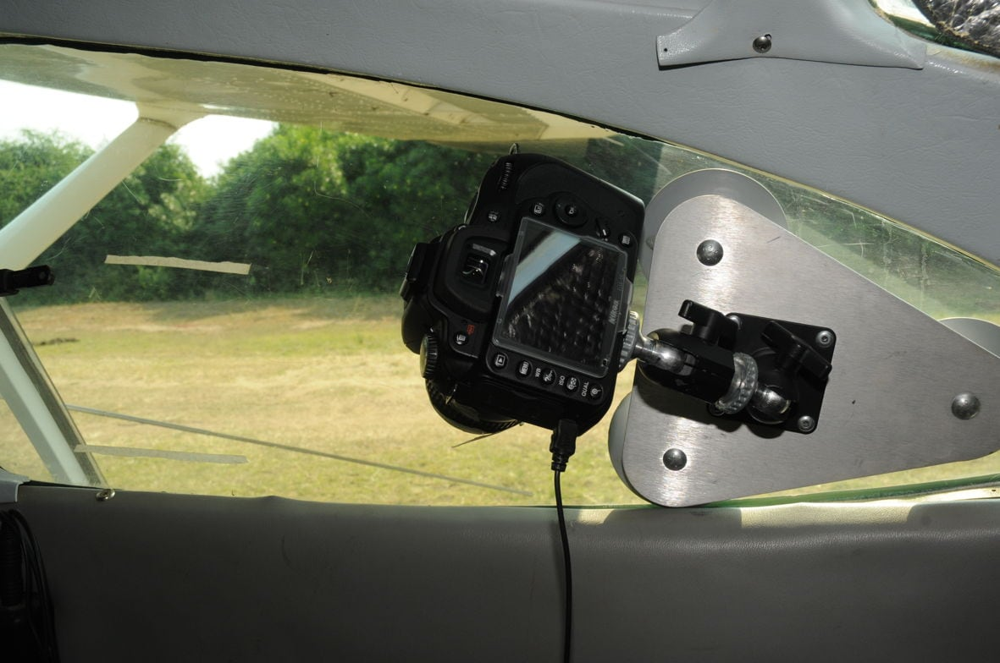

The cameras are placed in a good position, with a known ‘target area’,
and cable releases attached. This allows the observer to simply press a
button when a group of animals is in view, and be confident that the
photograph was taken, with minimal disturbance to his/her observation of
the strip.

The ideal position for the camera is one in which it has exactly the
same field of view as the observer; this is unfortunately impossible, as
the observer’s head and the camera can’t occupy the same position!
However, during calibration setup a good approximation can be made that
gives almost exactly the right field of view.

Depending on the aircraft, there may be space behind or in front of the
observer to place the camera. The best position is probably in *front*
of the observer, with a view perpendicular to the aircraft.

**Instructions:**

1. Hold the camera in a position that is close to the observer’s head
   (they should be seated and helping with this) but that does not block
   their view.

2. Take test photographs of the streamers, and, using the photographs,
   move the camera to *line up the streamers and the ground marks*.

3. Once you have determined this ideal position for the camera, attach
   the camera mount to the window. Attach the camera and move the
   jointed arms until you have found the position from 2 above.

4. Tighten the screws or locking units and take more test pictures: is
   it in the correct place? Redo 3 if not.

5. Tap the camera firmly with one finger to make it wobble – it should
   not twist or otherwise move from position. If it does, repeat 3-4 but
   tighten everything more firmly.

6. Attach the cable release to the camera port.

7. Have the observer sit normally and practice taking photos, to get an
   idea of the ‘target area’ where he/she should trigger the camera.

   a. This target area *will be slightly different in the air*, but is
      still a good approximation.

   b. Move objects into the field of view of the camera to show the
      foremost and rearmost edges of the camera view – the observer can
      look at these to get an idea of where the ideal zone is.

Tips

-  Setting the lens to focus on infinity: the easiest way to do this is
   to first leave the lens on ‘autofocus’, and then focus (or take a
   picture) at an object at least 200m away (approximately the distance
   of observations from the aircraft). Use electrical tape on the focus
   ring, gently pressing it in place, then switch the camera/lens to
   manual focus.

-  Read the manual for the camera – they are all different, and
   understanding how to quickly check all these parameters is really
   important, and can save you much aggravation. *Know your equipment*.

-  Attaching camera mounts to the Cessna window requires that you press
   hard on the window – have someone press on the outside of the window
   at the same time, to avoid popping the window out of the frame!

-  Loop or tie the cable around the camera mount – if the cable is
   pulled hard it will then pull on the mount, not the plug on the
   camera itself!

Caution!

-  **The RSO’s attention must be on the strip at all times during actual
   transect flights.** It is very worthwhile checking the field of view
   of the camera during training and test flights – the RSO should take
   photos and then look at the image on the camera back to confirm that
   the camera is taking pictures of the same area, and then adjust
   his/her technique appropriately. However, this experimentation must
   be done by the beginning of survey work, and the RSO must *not* check
   photos once transect work begins.

*
*

|image17|\ GPS
''''''''''''''

The pilot GPS will no doubt be set up to the individual preference of
the pilot; the FSO GPS should be set up in a consistent manner for the
use of the FSO. Check:

-  Battery level: this is not as tricky as camera battery levels, but
   you should not start with a quarter charge or less.

-  Transects: are these uploaded correctly? Zoom out until you can see
   the transects and subunit lines or points on the map, and confirm
   that they seem to be the correct distance away.

-  Is the GPS getting a position correctly? The GPS should be turned on
   and a position verified before you enter the aircraft (see example to
   the right, from a Garmin GPSMap60).

Tips

-  Practice removing and replacing the GPS batteries until you can do it
   almost without looking. *Know your equipment*.

Survival kit
''''''''''''

A minimum set of survival supplies and equipment must be carried on the
aircraft, under the seats or in the rear cargo area (not in a luggage
pod under the aircraft, as this is often destroyed even in a survivable
emergency landing).

-  2 litres of water per person;

-  First aid kit with bandages, painkillers, tape;

-  Energy bars or biscuits;

-  Matches or firestarters;

-  Survival blankets.

Forms
'''''

The FSO should have one form for each planned transect, plus spares, and
a clipboard.

Flight standards
^^^^^^^^^^^^^^^^

There are important standards for flying transects which must be
followed.

**Time of day**\ *:* Survey flying is usually conducted in two flights
each day, morning and evening. No counting is permitted between 11:00
a.m. and 3:00 p.m., because animals tend to seek shelter under trees at
these times and therefore are less visible.

**Weather**\ *:* No counting is permitted in bad weather – there are
safety concerns, and it affects the behaviour and visibility of animals.
Scattered light rain is not considered a problem. A crosswind > 20 knots
is grounds for cancelling a flight. In a strong crosswind the strip
width will be increased by an unknown amount, which cannot be reliably
corrected for.

**Length of flights**\ *:* Transects should last no more than 45
minutes. If they last longer, transects should be broken at a recorded
GPS point or geographic subunit in order to prevent observer fatigue –
take five minutes to circle, stretch, have sweets and biscuits! Be sure
to record breaking point carefully on the GPS so that the remainder of
the transect can be flown accurately at a later time!

**Session length:** Counting sessions should last not more than 3 hours.
The ability of any observer to concentrate on counting is reduced after
3 hours and only gets worse!

Flight procedure
^^^^^^^^^^^^^^^^

1. Crew boards and confirms equipment and status:

   a. RSO tape recorders have sufficient battery and tapes;

   b. Cameras have sufficient battery and memory;

   c. FSO has GPS, spare batteries and forms;

   d. Pilot has transect points uploaded to GPS.

1. The pilot takes off and flies to the transect area.

   a. FSO records takeoff time.

   b. FSO announces, and RSOs record: date, survey, session, e.g.
      *“Kidepo National Park, 10 August 2010, morning session”.*

2. Transects are flown:

   a. Approaching the transect, the FSO announces the transect number to
      the RSOs, e.g. *“TRANSECT TWENTY*\ ”. RSOs record this in their
      voice recorders.

   b. At the beginning of the transect, the FSO begins to call subunits:
      “\ *Subunit One”,* and this is recorded by RSOs in the voice
      recorder.

   c. For each subunit the FSO announces the number: “TWO”, “THREE”,
      etc., and this is recorded by RSOs.

   d. From the beginning of transects, RSOs record animal observations.

      i.  For each observation, they record the species code (twice) and
          estimated group size, and any pictures taken, e.g. “Elephant
          elephant five”, “Zebra zebra fifty two, two frames”.

      ii. If groups are greater than ten, photographs should be taken.

   e. At the end of the transect, the FSO announces “\ *END OF
      TRANSECT*\ ” and RSOs record this.

Postflight procedure
^^^^^^^^^^^^^^^^^^^^

After parking the aircraft, equipment and data forms are taken with the
crew back to the field base, and the ground coordinator ensures that
data are properly taken care of:

1. Ground coordinator takes charge of:

   a. Pilot and FSO GPSs

   b. Camera memory cards

2. GC provides forms to RSOs and checks that they are situated well away
   from distractions to fill forms.

3. RSOs transcribe their tapes onto paper forms

4. GC downloads data from GPSs and cameras.

5. FSO checks and submits data forms to GC;

6. RSOs submit data forms to GC;

7. GC checks FSO and RSO forms;

8. Flight paths and waypoints are mapped and cross-checked with recorded
   transect numbers.

9. GC debriefs pilot and crew, and makes plan for afternoon flights.

Pilot
~~~~~

The duties listed here are in addition to normal preflight checks.

Preflight
^^^^^^^^^

1. Confirm transect map and briefing with ground coordinator & FSO;

22. Confirm your GPS is uploaded with transect endpoints & route;

During flight
^^^^^^^^^^^^^

1. Navigate to the starting area of the session. Announce the time en
   route to the crew.

2. Note the session starting time: you should not exceed 3.5 hours of
   actual transect flying, and return to base when time is up.

3. Confirm (announce) upcoming transects at least 1 minute prior to the
   first one, and ensure that FSO and RSOs are on the job.

4. Confirm that the FSO correctly announces the beginning of the
   transect (“Subunit one!”) and the end of transect (“End of
   transect!”).

5. Confirm that trainee FSOs are recording data correctly from time to
   time, and watch for dozing observers especially on long, hot flights!

Postflight
^^^^^^^^^^

1. Submit GPS to ground coordinator for download.

2. Debriefing:

   a. Update number of hours remaining to maintenance;

   b. Review remaining transects in block and make plan for next
      session.

   c. Review fueling issues.

   d. Set time with crew for next session and make sure everyone is
      aware (people often drift off or oversleep before afternoon
      sessions!).

FSO Duties
~~~~~~~~~~

.. _preflight-1:

Preflight:
^^^^^^^^^^

1. Confirm transect map and briefing with ground coordinator & pilot;

2. Confirm GPS loaded with subunits, transect endpoints & route;

3. |image18|\ Check that you have enough FSO forms (typically one per
   transect), pencils and clipboard;

4. Extra batteries and tape recorder.

5. Turn on GPS and confirm it receives satellites (see the screenshot on
   the right).

.. _during-flight-1:

During flight:
^^^^^^^^^^^^^^

1. Confirm upcoming transects with pilot;

23. Announce upcoming transects: “Next transect is transect one hundred
    and twenty – one two zero”. You should do this one minute or so
    before the transect is reached.

24. The beginning of the transect will appear on the GPS. Announce
    beginning of transect: “Subunit One”.

    a. Write time START, to the nearest second;

    b. Confirm correct waypoint, and mark a new waypoint if a
       non-planned point is used.

    c. Write radar altimeter height.

25. The beginning of each subunit is marked on the GPS as a point or a
    grid line. When it is reached:

    a. Announce the number: “TWO”, “THREE”, etc.

    b. Write down the radar altimeter height about every 30-45 seconds –
       at least once for each subunit and not more than three: e.g. 350,
       320, 380.

    c. During the subunit, write down additional observations as
       required by protocol (presence of human activities, fire, etc.).

26. Announce “END OF TRANSECT” on the final point, or if the pilot
    chooses to call end of transect early.

    a. Write time END.

    b. Take a GPS point if a non-planned point is chosen, and write this
       on the form.

Post flight:
^^^^^^^^^^^^

1. Fill in all metadata blanks on data sheet (date, initials, aircraft,
   survey).

2. If there are actual data missing, point it out to the ground
   coordinator (‘vital data’ (see below) you cannot get after the
   flight, or it is difficult to get; ‘important data’ can be sometimes
   missed (radar altimeter) or found elsewhere (e.g. GPS log).

Data to Collect
^^^^^^^^^^^^^^^

Vital data:

-  GPS start and end points

-  Changes to planned transect – take new GPS points if there are any
   changes due to terrain or other issues.

-  Cultivation, habitation, villages, tin sheets (of any kind, whether
   housing or storage or other structures), as per survey protocol.

Important data:

-  Time start and end, to the nearest second.

-  Radar altimeter heights to the nearest ten feet.

Optional

-  Poacher’s camps, dead elephants, unusual sightings -> Take a
   waypoint!

-  Any other observations – fires, other illegal activities.

RSO Duties
~~~~~~~~~~

.. _preflight-2:

Preflight:
^^^^^^^^^^

1. Check operation of tape recorder. Record date and session
   information, and play it back.

2. Confirm spare batteries.

3. Check the position of the streamers and tape – do they line up? Does
   anything appear to have moved? If so, inform the ground coordinator.

4. Take a test photo and ensure proper operation of camera and cable
   release – is the field of view correct?

5. Review the species in the area from your code sheet and with the
   other crew – any surprises likely?

.. _during-flight-2:

During flight
^^^^^^^^^^^^^

1. Sit comfortably, ensure that the inside tape is lined up with the
   streamers.

2. Record all information given to you by the FSO: transect number,
   subunit number, end of transect.

27. Scan both forwards and backwards; many species will stay immobile
    until the plane has passed.

28. Count, and photograph, in the target area *perpendicular to the
    aircraft*.

29. Record the observations on your handheld tape recorder:

    a. State the species name twice;

    b. State the estimated number;

    c. If photos are taken, indicate the number and the word “Frames”.

    d. E.g. “Zebra zebra five”, or “Elephant elephant twenty, two
       frames”.

       *State the species code twice because you may delay a little bit
       in recording, and speak too early – ending up with a number but
       no idea which species it was!*

30. If you do not have mounted cameras: be ready to take photos but keep
    the camera on your lap or your arm will become fatigued.

31. For large herds, you will need to take several pictures in a row to
    ensure you photograph everything. Photos must be overlapping so that
    we know we have the entire herd. Don’t be afraid to take extra
    pictures – with practice you will learn the correct spacing and be
    able to correctly overlap with a minimum of photos, but in the
    beginning take extra.

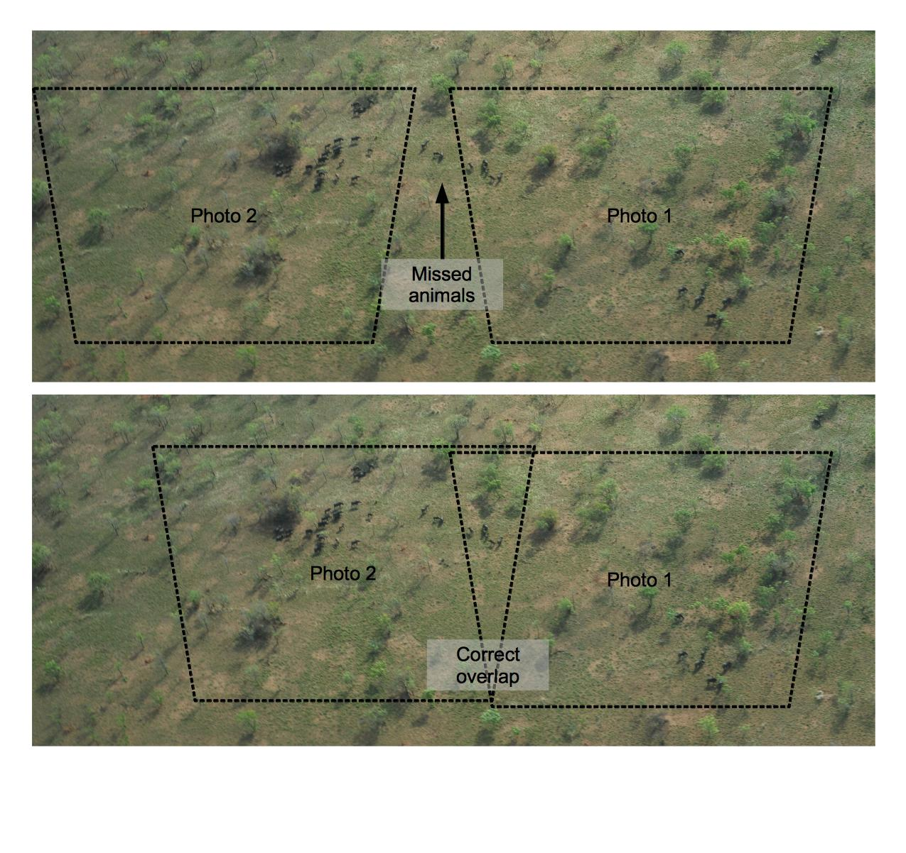

Tips

-  Play with the tape recorders (know your equipment!) until you are
   familiar with every aspect of their operation. We normally use
   old-style tape recorders because they have large buttons that are
   easy to press, and easy to feel that they have been pressed, even in
   a noisy, bumpy aircraft; get used to how it feels even without
   looking at its operation.

-  The easiest way to use most recorders is to press RECORD and then use
   the PAUSE on/off switch to start and stop recording.

.. _post-flight-1:

Post-flight:
^^^^^^^^^^^^

1. Return your camera to the ground coordinator. Immediately inform
      him/her if you took pictures of animals on transects!

2. You will fill in the data sheets for RSO data – fill in initials,
   survey name, date and seat position.

3. Choose a place where you will not be distracted by anyone, including
   your neighbouring RSO who will also be listening to their tapes. You
   must immediately start this work – you may have a cup of tea or a
   soda, but not eat.

..

   *This is not to be cruel … you have a chance of catching mistakes,
   and remembering actual numbers / species, immediately after the
   flight. If you wait, nap, eat, get distracted, this is no longer the
   case.*

4. Play back your tape recorder.

5. Fill in transect number and each subunit as you hear it:

   a. If you miss a subunit (i.e. ‘5’ follows ‘3’), write an X for the
      missing subunit (i.e. for ‘4’).

   b. If the subunit is empty of animals, write a dash (–).

6. If a subunit has observations, fill in the species code and number of
   animals estimated.

   a. Immediately confirm species codes if you come across something not
      on the code sheet. Do NOT invent your own codes!

7. If you took pictures, indicate the number of frames by putting a
   square box around the number.

   a. Count these pictures with the ground coordinator after the
      session.

8. Submit your forms to the GC.

RSO Observational Method
^^^^^^^^^^^^^^^^^^^^^^^^

Observing is not something that can be done casually, though it seems
very straightforward. Basic skills include species identification and
ability to estimate groups and operate a camera; the observer also needs
to cultivate a method for scanning forward and back from the primary
engagement area, and to not be distracted from counting and observing in
the perpendicular target area.

**Basic rules:**

-  Count and record all the animal observations that appear within the
   sampling strip.

-  Photograph groups greater than 10 and record the number of frames
   taken.

-  Do not record animals that run **into** the strip next to the
   aircraft; likewise, you may include animals that have *just* moved
   out of the strip in response to the aircraft, though you must be very
   sure that this was the case.

**Scanning**

While the basic rule is to count and photograph animals at the closest
point of approach, right next to the aircraft, you need to be looking
forwards and backwards:

-  Animals are often spotted before the aircraft comes up on them, and
   (particularly for large herds that need photographing) you can get
   ready to count and photograph the group;

-  Some animals freeze as the aircraft passes, making them more
   difficult to see, and then move after you have passed – if you scan
   behind you regularly, or use your peripheral vision, you will pick
   these animals up

   *Inexperienced observers, as a result, usually miss kudu and
   bushbuck, who are very good at sneaking around the back of trees as
   you pass. After a few days of experience you will begin to see far
   more of these cryptic animals.*

How do we deal with this? Each observer develops their own scanning
technique, but some tips can help.

Whatever you do, you must scan all areas of the strip and should spend
an equal amount of time on each area. Using a crisscrossing scan in each
field of view, starting at top left, moving to the right, then down to
the left, then right again, works very well for this and forces you to
scan the entire field (see the illustration below).

Get in the habit of scanning three separate fields:

-  Next to the aircraft;

-  Forward of the aircraft;

-  Immediately behind you – this can be a quicker scan, as normally you
   will pick up movement from animals like kudu and bushbuck that flee
   after you have passed.

You should spend most of your time scanning perpendicular to you and
forward, and occasionally look behind you. Think “side – forward – side
– forward – side – behind”.

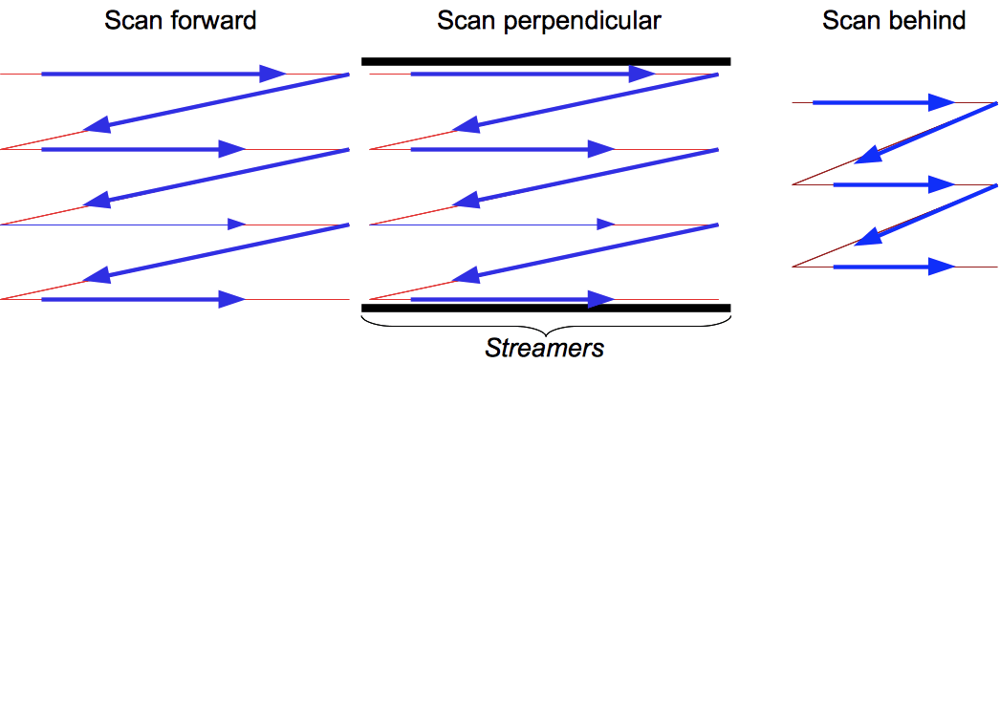

Figure 10: Scanning technique.

**Searching the whole field**

It can be extremely easy to miss animals, even right in the middle of
your field of view. Using the scan technique above is really helpful,
but we need to spend special attention on some areas.

-  **Shadows**: when there are areas of shadow in the field of view, it
   is necessary to spend extra time searching those areas – *give them a
   second look*.

-  **Scattered groups**: when you see a group of animals, the immediate
   tendency is to focus on them, get a good count … and at this same
   time you risk missing the five animals on the other edge of your
   field of view! Get a good look at the animals out in the open that
   you first saw, but then make sure you scan the rest of the field.
   This is where the scanning technique above is particularly helpful –
   especially spotting the animals early, in *front* of the aircraft.

**In or out?**

If animals were more considerate of the researcher, they would stay
completely still and either be clearly in or out of the strip. Probably
the most difficult aspect of counting is determining whether a certain
group, or individual, should be counted or not.

It is important to make a quick judgement about whether an animal or
part of a group was in or out of the strip, and stick to that judgement
– do not spend too much time trying to decide, focussed on one
problematic group.

The following diagrams illustrate some of the possibilities and issues:

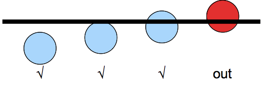

Individual animals are counted as *in* if they are more than halfway
inside the strip.

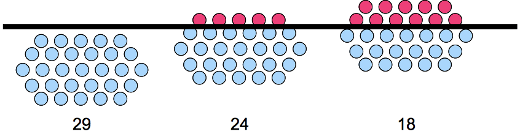

Count the number of animals in a group that are inside the strip. Make
an estimate, and take a photograph.

Figure 11: In or out of the strip - what to count.

Ground Coordinator
~~~~~~~~~~~~~~~~~~

This position may be taken by the FSO, but ideally this is done by a
senior officer who is responsible and diligent about data quality, and
has the technical background to download, upload and organise data. The
GC should be familiar with all stages of the survey, from planning to
survey flights to the health and morale of the team. The GC must know
all the processes involved by all crew.

Pre-flight
^^^^^^^^^^

1. Upload GPSs:

   a. Pilot: route with transect beginning and end points;

   b. FSO: route with transect and subunit points.

   c. Confirm that old tracks have been saved.

2. Brief pilot and crew on session plan, and provide equipment

   a. GPS units;

   b. Check spare batteries for RSO / FSO;

   c. Confirm FSO forms / clipboard;

.. _post-flight-2:

Post-flight
^^^^^^^^^^^

1.  Remove camera cards, and check battery level. Take battery if
    showing even slight drop.

2.  Receive pilot and FSO GPS (it may be worthwhile only taking the
    pilot GPS at the end of the day).

3.  Download GPS data:

    a. Save to at least two file formats on your computer: GPX and ESRI
       shapefile (.SHP).

    b. Naming convention: **YYYY-MM-DD
       [AIRCRAFT][Position][Keywords].gpx**, e.g. **2010-11-05 5HCFA FSO
       Kidepo.gpx**

       *A naming convention like this must be applied diligently to all
       digital data – and it will save you hours of frustration in the
       future! In this way you know when each file was made, from which
       GPS it came (FSO GPS) and some keywords to describe it.*

    c. Map the data to confirm you have recorded the correct
       information!

    d. For the FSO GPS only: Copy the old track data to GPS memory (if
       available) and erase the old track. BEFORE you erase, confirm
       that you have GPX and SHP files saved for track and points!

4.  Download camera data.

    a. Make a folder for each observer’s data, and use a similar naming
       convention as above: **YYYY-MM-DD [AIRCRAFT][Position] [SESSION
       AM/PM]**, e.g. **2010-110-05 5HCFA RSO AM** – this tells you
       which aircraft, position and session the data came from.

    b. Download the data from the card to the folder.

    c. If there were no photos taken, make a README.txt file and make a
       note that no photos were actually taken.

    d. Confirm that the photos are in the directory, then erase the
       card; alternatively, with very large memory cards, there is no
       need to do this on a daily basis.

5.  Receive and check FSO data, and get the FSO to correct errors:

    a. Count the number of forms, and compare to flown transects.

    b. Are all metadata filled in?

    c. Are sheets readable?

    d. Are there changes to transect start/end points? Ensure these are
       written down properly.

6.  Receive and check RSO data:

    a. Count the number of forms, and compare to flown transects.

    b. Are codes correct?

    c. Metadata filled in?

    d. Photos taken and indicated in form?

7.  Punch and file FSO and RSO forms.

8.  Back up the downloaded data.

9.  If time permits, count photographs immediately with RSO.

10. Debrief pilot and crew:

    a. Review the transect map – what has been done to now? What is
       remaining?

    b. Plan the next session, and confirm the time to meet to go to the
       airstrip again.

Tips

-  GPX is an excellent backup for GPS data, as it is an open-source
   standard and readable by most GIS packages. It keeps all the data
   from a GPS: waypoints, tracks and routes (see the Appendices for
   links).

-  You can take the camera and attach a USB cable to it directly, but it
   is almost always a lot faster and more reliable to remove the data
   card and use a card reader.

Other duties
^^^^^^^^^^^^

Depending on schedule, the number of aircraft involved, and logistical
issues, there are number of other jobs the GC can do.

**Data entry**: starting data entry early is extremely valuable. It is
often possible to correct errors (poorly written data, for example)
immediately after a flight.

**Counting photographs**: this needs to be done as soon as possible, and
is valuable for a number of reasons:

-  Problems with photographic technique can be picked up immediately;

-  It can still be difficult to see animals even in a good photo, and
   the RSO can help you pick them out soon after the flight – this is
   not possible a week later!

Analysis
--------

The following analysis instructions are based on using SRF_UWA_0.1.xlsx,
which is available on the Counting Animals temporary website:

http://www.countinganimals.underdiverwaterman.com.

There are several software tools for analysis of sample count data using
the Jolly II method outlined in Norton-Griffiths (1978), and this is
just one example. You will find other tools on the website, and are
encouraged to play with them all! You can also work it out on paper, and
in fact you must do this at least once to really understand the steps
involved.

Regardless of the tool used, the following steps apply (with variable
names indicated as per Jolly II calculations (Norton-Griffiths 1978),
where:

+-------------+-------------------------------------------------------+
| N           | Number of sample units in the population (how many    |
|             | non-overlapping transects *could* you have flown?) =  |
|             | baseline / average strip width.                       |
+=============+=======================================================+
| n           | Number of samples (transects) actually flown;         |
+-------------+-------------------------------------------------------+
| Z           | Area of the entire census zone.                       |
+-------------+-------------------------------------------------------+
| z\ :sub:`i` | Area of transect ‘i’.                                 |
+-------------+-------------------------------------------------------+
| y\ :sub:`i` | Number of a certain species counted in transect ‘i’.  |
+-------------+-------------------------------------------------------+
| |image21|   | Overall density of that animal species = sum of all   |
|             | observations in all transects / sum of area of all    |
|             | transects.                                            |
+-------------+-------------------------------------------------------+

1. Transect length, width and thus area are calculated and summed
   together (“Survey Area”= “Z”)

2. Strip area is calculated for each transect, based on flying height
   per subunit or the average flying height per transect (“Strip Area” =
   “z”);

3. Number of observations for each species are tallied by transect (y);

4. Overall density is calculated:

.. math:: \widehat{R} = \frac{\sum_{}^{}y_{i}}{\sum_{}^{}z_{i}}

5. Variance of observations is calculated:

..

   :math:`{s_{y}}^{2} = \frac{1}{n - 1} \times (\sum_{}^{}{y_{i}}^{2} - \frac{(\sum_{}^{}{y_{i})}^{2}}{n}`)

6. Variance of sample areas is calculated:

..

   :math:`{s_{z}}^{2} = \frac{1}{n - 1} \times (\sum_{}^{}{z_{i}}^{2} - \frac{(\sum_{}^{}{z_{i})}^{2}}{n}`)

7. Covariance between observations and sample areas is calculated:

..

   :math:`s_{\text{zy}} = \frac{1}{n - 1} \times (\sum_{}^{}\text{zy} - \frac{\sum_{}^{}z\  \times \ \sum_{}^{}y}{n}`)

8. Population estimate is calculated:

.. math:: \widehat{Y} = \widehat{R} \times Z

9. Population variance is calculated:

.. math:: \text{var}\widehat{Y} = \frac{N(N - n)}{n} \times ({s_{y}}^{2} - 2 \times \widehat{R} \times s_{\text{zy}} + \ {\widehat{R}}^{2} \times {s_{z}}^{2})

10. Standard error:

.. math:: \text{SE}\left( \widehat{Y} \right) = \sqrt{\text{var}\widehat{Y}}

11. Confidence limits for :math:`\widehat{Y}`: look up ‘t’ at n-1
    degrees of freedom at a given α:

.. math:: \pm \ t\  \times SE(\widehat{Y})

Data entry
~~~~~~~~~~

This guide assumes that you are familiar with Excel spreadsheets:
opening tabs, entering data, saving. Spreadsheet tab names, variables
and Excel commands are all here indicated in monospace bold type;
commands or menu selections are indicated in order of the commands as
you select them, e.g. **EDIT:PASTE SPECIAL:VALUES** to indicate that you
select the **EDIT** menu, then **PASTE SPECIAL**, then **VALUES**. In
this and other sheets, green shading indicates data you should fill in.

This sheet is designed with *variable names* and *tables*. This allows
Excel to reference and calculate other sheets more easily and/or for us
humans to read and remember references. For example, in the
**Calibration** tab the slope for the left observer is called
**SlopeLeft**, and this is what is referred to in equations instead of
“E4”. Any equation that uses **SlopeLeft** will return the number in
that cell, e.g. 0.363 in the example.

   **Caution!**

   It is crucial to enter data carefully: when typing in cells, make
   sure you use the same transect number (or label), species codes, etc.
   Don’t type spaces when entering data or Excel may think you’re
   putting in a text label instead of a number, and so on.

To delete rows in a table, select the whole row (or set of rows) by
clicking and/or dragging in the row numbers on the left side, then
right-clicking and selecting **Delete**.

1. Open the calculation spreadsheet (**UWA_calc_0.1.xlsx**).

..

   *In the beginning it is probably worth opening up the example
   spreadsheet (UWA_example_calc_0.1.xlsx) and looking at the example
   tables to familiarise yourself with the process.*

2. Check **SPECIES CODES** (the first tab).

   a. Confirm that these codes are correct for the survey you’re
      entering, and that the common names are filled in properly.

..

   *The codes used during the survey should match your organisation’s
   master list of species codes. If the codes used in the field are
   different, you must make a clear note in both the paper documents and
   the calculation sheets, indicating the codes used.*

3. Enter calibration data in the **Calibration** tab (this should
   already be done in the field):

   a. Enter the metadata: survey name, aircraft, crew names, etc.

   b. Enter the target information: ideal strip width, flying height,
      distance between markers.

   c. Enter the pressure, radar and marker values for left and right
      observers in the green shaded area. “Target” height doesn’t matter
      but, if written on your sheet, is worth recording.

   d. As you fill in the data the graphs and regression variables will
      fill in automatically.

   e. When the data are entered, check the graphs and values as per the
      instructions in the “Calibration” section of this manual.

   f. Values that are out of range in the calibration will be
      automatically highlighted in red – i.e. the radar altimeter
      reading of 1.18 in the example. RECALIBRATE if there are problems
      here!

   g. Check that the Slope and Intercept values are filled in next to
      each observer’s name.

4. Enter all the FSO data in the FSO tab – each row is for a single
   subunit, and you enter data under the columns highlighted in green:

   a. Transect number, subunit number, one to three radar altimeter
      readings.

   b. Mean height, strip widths (left, right, total) and areas are
      filled in automatically.

5. Enter the RSO data in the RSO tab:

..

   *Each row is for a single observation of a single species. You will
   have repeated rows with the same subunit and transect and/or species
   codes for multiple observations within a single subunit.*

a. You enter all columns in this case: observer initials or name,
   transect, subunit, species code as per the species list, the
   estimate, how many pictures were taken, how many were counted from
   the photos.

b. Correct Count uses the estimate column unless there is a photo count,
   in which case it uses the photo.

..

   *If there were problems with the photo count, then do not fill in the
   “photo estimate” column. Change the ‘estimate’ column if you need to
   make corrections, but make sure you note this in the comments and on
   the paper form.*

Tip

-  There is an example spreadsheet available showing the calculations,
   based on Queen Elizabeth National Park survey data from 2010. It is
   on the website with this manual.

Population Estimates
~~~~~~~~~~~~~~~~~~~~

1. Update all of the calculations in the spreadsheet and check:

   a. Press **Control-Alt-F5**. This updates all of the calculations and
      tables in the spreadsheet.

   b. Open up the **Area and Subunits** tab: this is a
      transect-by-transect summary of all the data from the FSO table.

      i.   Are all the transects indicated in the “row labels” column?
           Are there any duplicates? Any “blanks” row? Any missing?

      ii.  Do the numbers of subunits look correct?

      iii. Are there any errors in the Grand Total row?

      iv.  If necessary, go back and check the FSO table, deleting
           partially-filled rows and correcting errors.

   c. Open the **Observation Table** tab: this is a transect-by-transect
      summary of all the observations made in the RSO table.

      i.   Check if all the transects are listed correctly, as above.

      ii.  Check the species codes – do they all make sense? Watch out
           especially for columns that look the same – “WB” and “WB “
           would indicate that one species code was entered with a space
           in the name and recognised by the computer as a different
           species.

      iii. Look at the numbers – anything crazy in there?

   d. Press **Control-Alt-F5** again and recheck before you go to the
      next step.

1. The **Jolly** tab shows the calculations based on these other tabs.

   a. Check that all the transects are listed on the left side.

   b. Look at the strip and transect areas look normal.

   c. Any errors in the table? Any errors in the table?

2. The **Results** tab shows a more nicely formatted table with the
   proper species names indicated.

   a. Have a hard look at the numbers here: do they make sense?

   b. Copy and paste this table (ignoring the #NA rows at the bottom)
      into Word.

Mapping (for UWA)
~~~~~~~~~~~~~~~~~

Grid cells and transects are laid out for Queen Elizabeth National Park,
the savanna parts of Kibale National park, Kidepo Valley National Park,
Lake Mburo National Park and Murchison Falls National Park. Accordingly,
instructions are given here for mapping using the grid cell system for
those survey areas.

The UWA grid system uses a 2.5 x 2.5 km grid cells for most of its parks
but a 5 x 5 km cell for Murchison Falls– each is the length and width of
a single subunit. These instructions use ArcGIS 9.x instead of QGIS as
this is part of the standard mapping method in UWA.

The density of a grid cell on the map is calculated simply by the
*number* of individuals of a given species seen in that cell, divided by
the *area* of the strip in that cell.

Tips

-  The method shown here uses a ‘Transect-Subunit’ (TRSU) relational
   system – each observation is identified by a number made from the
   transect and subunit it came from. E.g. subunit 5 in transect 20
   becomes TRSU 2005.

-  The area of each subunit is calculated in the FSO table from the
   *average height above ground* in each subunit and the *calibration
   regression*:

   :math:`Strip\ width = average\ height*Slope + Intercept`

-  A pivottable summarises the FSO data by TRSU and species, and the
   density of each species seen in each TRSU may be calculated by
   dividing the *number observed* by the *area*.

You will need the UWA calculation spreadsheet and a master list of the
grid cells in the survey region. An example is shown below – the actual
grid cell co-ordinates will need to be determined by your survey zone at
the time and filled in. This example data comes from QENP 2010.

1. Open the UWA Calc spreadsheet with the calculated data (from 2.5.1)

2. On the **FSO** tab, Fill in the “Lat” and “Lon” rows of the table
   based on the starting and end points of the transects and your master
   list of cells.

3. The **Mapping1** tab has a pivottable summarising the RSO data by
   subunit. Update it:

   a. It should be updated, but if not press **Control-Alt-F5**. This
      updates all of the calculations and tables in the spreadsheet.

   b. To the left of the pivottable are three rows that look up data
      from the FSO and RSO data, giving latitude, longitude and strip
      area. The first row is filled in but needs to be copied (drag
      down) to the bottom next to the end of the pivottable (see the
      example spreadsheet if necessary).

4. Create a new table using the pivottable, area and species data:

   a. Select the pivottable from the “\ **Lon**\ ” column label to the
      lower right corner, and **copy**.

   b. Move to the **Mapping2** tab. Paste only the values into the upper
      left corner: **Edit: Paste Special: Values**.

   c. Change the column headed **Row Labels** to **TRSU**. (ArcGIS won’t
      accept variables with spaces in the name).

   d. Save the spreadsheet (**control-S**).

   e. Save the sheet as a text file so that ArcGIS may read it: **File:
      Save As** then select Comma Separated Values (csv) as the file
      type.

5. Create the density map layer in ArcGIS

   a. Click the **Add Data** button;

   b. Select the CSV file created in the previous steps and add it; it
      will now appear as a table in the contents.

   c. Right-click on the new table and select “\ **Display XY data
      …**\ ”.

   d. The next dialog will have automatically selected Lat and Lon as Y
      and X coordinates, but confirm that this is correct. Click **OK**.
      You now have a layer of points for each subunit.

   e. Right-click the new point layer and select **Properties**, then
      the **Symbology** tab.

   f. Select **Quantities** then **Graduated Symbols** on the left of
      the window.

   g. For the species you want to map, select its code from the
      “\ **Value**\ ” field (i.e. EL for elephant).

   h. Under “\ **Normalisation**\ ” select “\ **StripArea**\ ”: this
      will divide all the observations by the area of the strip in that
      subunit.

   i. Click on the **Template** button on the right an change the base
      symbol to a hollow circle: select the **Circle 2** symbol from the
      list and change the colour to “\ **no color**\ ”.

   j. Change the symbol sizes to range from 6 to 24.

   k. Click OK. You now have a density map (in animals per km\ :sup:`2`)
      for that species.

6. |image22|\ For the remaining species, copy and modify this layer:

   a. Right-click and **copy** the first layer.

   b. Right-click and **paste**.

   c. Right-click and modify **properties**.

   d. Change the **Value** field to match the next species.

   e. Change the **Classes** field from 3 to 4 then back to 3 – this
      updates the classification (there may be a better way of doing
      this).

   f. Click **OK** then be sure to change the name of the layer to match
      the species.

Total Counts
============

Total Counts are a *complete census* technique. In contrast to a sample
count, which looks at parts of a population and *estimates* the total
population size, a total count (TC) attempts to count *all* the
individuals and groups in a population. In a TC the aim is to visually
search the entire survey area, and to do this as quickly as possible to
reduce the effect of animal movement.

As you can imagine, searching for and counting all the individuals in an
area is far more intensive than taking a sample: it is a more expensive
technique (often over 5 times more expensive than a sample count of the
same area).

Total counts are typically used for special target species which are
less effectively counted in SRF. Elephant and buffalo are the most
commonly total-counted species, as they are highly aggregated/clumped
and SRF estimates tend to have extremely wide confidence intervals
because of this clumping. SRF relies on the assumption that the
distribution of animals in between transects is the same, or similar to,
the distribution in the sample strip (see Figure 1). If animals are
highly aggregated, the tendency is for some transects to have very high
counts and others to have low or none – this leads to very poor
confidence in our results: what would have happened to the SRF estimate
below if one of the two large groups had actually been in a
transect? [1]_

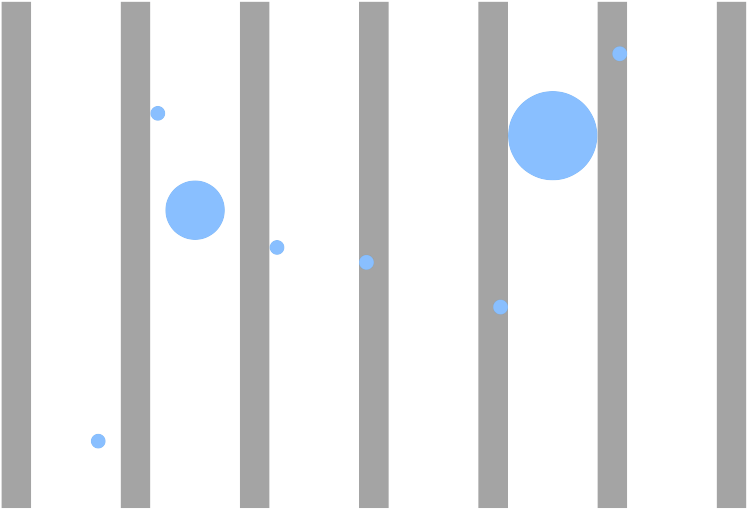

In comparison, a total count follows a tighter flight pattern (example
below) and groups are all counted; those spotted further away from the
flight line, or larger groups, are circled and counted:

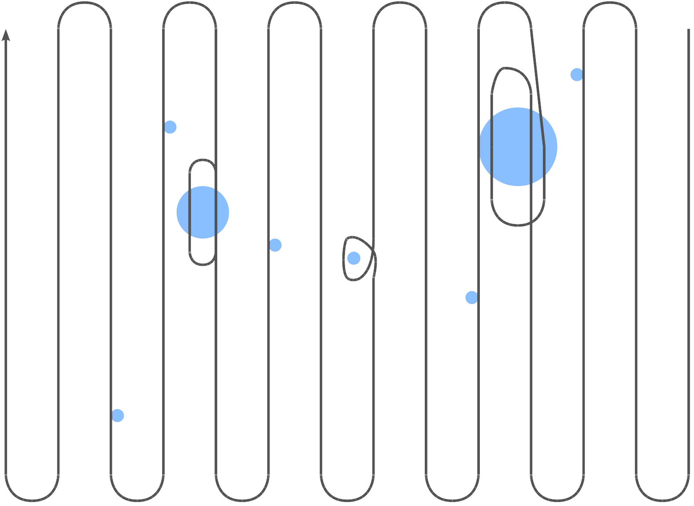

Caution!

Because total counts assume that the entire population is counted, they
are often given great weight in reports and in analysis of trends. Total
counts, however, are still *estimates* and we must treat them as such.
There are other sources of bias and error that may make the estimate
unreliable, and in particular we must remember that aerial surveys may
miss large proportions of the populations of some species, and there are
often substantial undercounts made in even lightly wooded habitats.

Procedure:
----------

The general process may be summarised as follows:

1. Aircraft proceeds to start line of search area.

32. Crew begins spotting for target species.

33. When a sighting is made:

    a. it is announced by the spotter (usually RSO), indicating
       distance, direction and estimate, e.g. “Elephant left, 200
       metres, estimate 12”.

    b. FSO records the GPS position, direction, distance and estimate,
       and repeats back the data;

    c. If the estimate is uncertain or > 20 animals the aircraft returns
       for photography:

       i.   The pilot makes a pass to the left of the group, or circles
            it;

       ii.  FSO makes a new waypoint and updates the form;

       iii. Photographs are taken;

       iv.  Aircraft returns to the flight line.

    d. Crew are all actively involved in keeping accurate track of
       groups and areas counted:

       i.  Possible duplicate observations are noted in flight;

       ii. Possible missed observations on the previous flight line are
           checked.

34. After the block is counted, data are downloaded from the GPS and
    cameras, and photographic data counted immediately.

35. Data are mapped and checked for duplicate observations.

36. Flight lines are mapped to ensure complete coverage.

37. Once duplicates are removed, totals are produced for entire survey
    region.

Bias in TC
----------

Careful attention to technique is important to reduce bias in total
counts. The table below discusses some major sources of bias (after
Jachmann, 2001), and briefly mentions the solutions to each.

+----------------------------------+----------------------------------+
| **Double counting** occurs when  | *The team must count each block  |
| individuals are counted more     | as quickly and efficiently as    |
| than once. This may happen in    | possible, to reduce the chance   |
| several ways.                    | of movement between passes over  |
|                                  | an area.*                        |
| -  Groups may move from one area |                                  |
|    to the next after being       | *Careful attention to previous   |
|    counted, and not recognised   | sightings (numbers, demographic  |
|    as being the same group.      | details, etc.), will allow you   |
|                                  | to identify movements, fusion    |
| -  Groups or individuals may     | and fission of groups.*          |
|    fuse or split by the next     |                                  |
|    pass, and thus seem like an   | *Pay attention to the behaviour  |
|    uncounted group or groups.    | of groups – it is often possible |
|                                  | to predict fusion or fission of  |
|                                  | groups from their behaviour as   |
|                                  | you fly by, and you can watch    |
|                                  | for it on the next flight line.* |
+==================================+==================================+
| **Improper coverage of survey    | *The pilot and FSO must watch    |
| area**:                          | the GPS live map to ensure that  |
|                                  | the complete lengths of flight   |
| -  When the aircraft does not    | lines are used.*                 |
|    cover the entire survey area, |                                  |
|    or                            | *Keep an eye on the range of     |
|                                  | vision you have on each flight   |
| -  When flight lines are too far | line – if there are areas that   |
|    apart to ensure complete      | you haven’t been able to see,    |
|    observation of all the area   | such as a valley or dense        |
|    between them.                 | vegetation, request an           |
|                                  | overflight of that area.*        |
+----------------------------------+----------------------------------+
| **Visual estimation of herds**:  | *Cameras are vital for counting  |
|                                  | large groups greater than 20     |
| -  As with SRF, estimation of    | animals.*                        |
|    herds by eye can lead to      |                                  |
|    serious inaccuracies;         | *Flying and photographic         |
|                                  | technique can reduce the effect  |
| -  Vegetation may obscure part   | of vegetation by providing       |
|    of the herd.                  | observers and cameras good views |
|                                  | of a group on fly-bys.*          |
+----------------------------------+----------------------------------+
| **Visibility & sighting          | *Aircraft (and pilots) that can  |
| probability bias:**              | fly slow and low will minimise   |
|                                  | this. The aircraft should fly    |
| -  Regardless of flying          | low enough to see individuals,   |
|    technique, vegetation and     | and slow enough to give the crew |
|    terrain may obscure           | enough time to search the field  |
|    visibility.                   | of view.*                        |
|                                  |                                  |
| -  The smaller a group of        | *Alternative methods such as     |
|    animals, the less likely it   | double-counting (Jachmann 2001)  |
|    is to be spotted              | can allow for estimation of      |
|                                  | missed groups and individuals.*  |
+----------------------------------+----------------------------------+

.. _survey-design-1:

Survey Design
-------------

As with SRF counts, flight plans are made for the survey area – in
contrast to SRF, these flight plans are *guidelines* for searching the
area and ensuring complete coverage.

Divide the survey area into counting blocks using features such as
roads, rivers, and hills.

-  It is suggested to use watersheds as the boundaries for survey blocks
   as this will increase the probability that elephant and buffalo are
   towards the centre of the block, along the watercourses, and reduce
   the chance that large numbers of animals will move to the next block
   in between block counts.

-  Other block boundaries that help block animal movement may be useful:
   major roads or major rivers (which are big enough to block or
   restrict animal movement), or terrain features (escarpments).

Set up a grid of lines in each block to be used as a route by the pilot:

-  The spacing between lines is dependent on the visibility in the
   habitat, and planning them may require reconnaissance flights,
   habitat maps and working with wardens and scouts who have knowledge
   of the area.

   -  500m spacing (i.e. 250m searched either side of aircraft) may be
      used in dense woodland;

   -  1 km spacing is more typical in lightly wooded habitat;

   -  Up to 3km spacing may be used in completely open, flat terrain.

-  The grid of lines should extend beyond the block boundaries for each
   flight – in other words, you should re-search these boundary areas.
   (Duplicate observations may be removed during flight or
   post-processing)

.. _crew-1:

Crew
----

Experience and diligence are extremely important in proper conduction of
any scientific enterprise, and this is no exception. Consistency of
method is vital for accuracy and for analysis of long-term trends, and
each member of the crew must meet certain standards.

Selection of experienced and capable staff is vital – it is important
for the entire crew to function well together and for the data produced
to be reliable and properly recorded. In particular, good communication
between the crew is important for proper recording of sightings in total
counts and for elimination of duplicate observations.

Pilots must be able to fly the transect plan with good height and speed
control, RSOs must be able to recognise the target species and make good
estimates, have good vision and endurance, and FSOs must be able to
quickly record observations from the RSOs and keep spatial track of
observations and the aircraft flight path.

However, it is also important to balance the need for experienced staff
with the need to give experience to junior staff, and to involve the
ecological staff of a given protected area in surveys. Accordingly it
may be necessary to allocate extra time for training, both on the ground
and in the air.

Most of the requirements for crew are similar to those for SRF, but
comments are made below for special requirements.

.. _pilot-1:

Pilot
~~~~~

Experience as per SRF.

Pilots in total counts must be able to make proper passes along a herd,
and have practice in choosing a point and navigating back to it (this is
far more difficult that you may realise, even with the help of a GPS).
They must also be able to circle tightly around a group but safely
without bringing the plane close to the stalling point.

Front Seat Observer
~~~~~~~~~~~~~~~~~~~

Front observers require more experience than with SRF.

-  In total counts the FSO needs to be totally familiar with the use of
   the GPS – instantly able to take waypoints and find the map
   navigation pages.

-  In addition to recording data and waypoints, the FSO works with the
   pilot to navigate and ensure total coverage of the survey area, and
   must thus have good spatial orientation skills.

.. _rear-seat-observers-1:

Rear Seat Observers
~~~~~~~~~~~~~~~~~~~

RSOs should have similar experience to SRF. In addition:

-  They must have a minimum of 4 hours of training specifically for
   total count methods.

-  They must be good at estimating distances from the aircraft, to
   decide which observations are to be included in the current flight
   line and to record the distance to individual observations.

.. _training-1:

Training
~~~~~~~~

As with SRF, time must be allocated before the survey for training and
familiarisation. At a minimum, even when staff members are experienced
and have had aerial survey experience within 12 months:

-  Review of target species in the survey;

-  Two-hour flight session, spotting and discussing the sightings and
   observations made, as per normal total count method.

-  Practice with cameras during that flight session and confirmation by
   senior officer that photographs are properly taken, and no groups >20
   animals missed.

-  Review of training slides with animal numbers for practice in
   counting groups.

-  Testing by senior officer with slides: estimation & species
   recognition. Species recognition must be 100%, and estimation of
   groups within +/- 20%.

Where RSOs have not had experience in aerial survey:

-  Training in counting groups and identifying species in the target
   area, ½ day minimum – as per SRF.

-  2 x 2.5 hour flight sessions, practicing total count method (2
   sessions).

-  Testing by senior officer, as above.

.. _fieldwork-1:

Fieldwork
---------

Flying technique
~~~~~~~~~~~~~~~~

Flying a total count is more flexible than in SRF – height may vary
depending on terrain and habitat, and flight lines are only guidelines
to ensure complete coverage. As emphasized previously, the method is
adapted to the specific conditions of animal distribution and visibility
in the habitat, but the following applies:

-  Height should be between 500 and 600 feet a.g.l.

-  Ground speed should not exceed 100 knots; use up to 20 degrees flaps
   on downwind legs (with caution).

-  Flight lines are guidelines, and you may depart from them as much as
   necessary to look at denser vegetation or any area which needs to be
   searched closely. Use the route or planned lines to ensure that you
   *do* cover the whole area, though!

   -  Patches of denser vegetation will need special attention. A spiral
      flight path is often used to cover a woodland patch, or closer
      parallel flight lines selected by careful attention to the GPS map
      in flight.

   -  Hills or valleys will obscure visibility, and you will need to
      likewise return for an overflight of hidden areas.

-  Photographing a large herd requires that you make a straight pass,
   not a curved or circling one; if you circle, it becomes very
   difficult to ensure overlap of all photos.

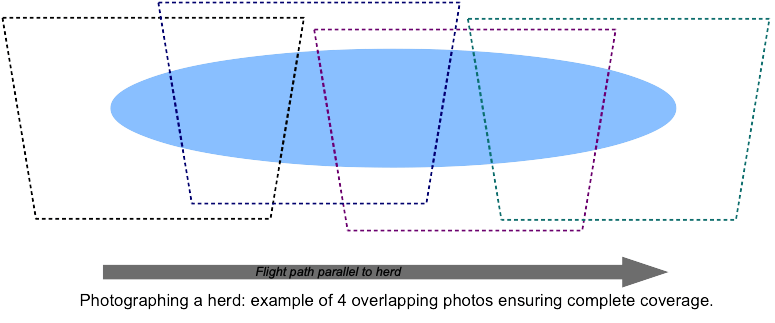

Figure 12: Total count photographic pass.

Crew Duties
~~~~~~~~~~~

In contrast with SRF, the whole crew may be involved in searching and
counting the area. Good communication is vital – due to the risk of bias
of missing or double-counting, the crew must all pay close attention to
the nature of the wildlife distribution they are seeing, tracking
individual groups and remembering what they've seen before and
discussing it to cross-check.

Having several people watching a survey area reduces the chances of
missing animals, but it brings with it an increased chance of
double-counting a group.

**Pilot**

The pilot’s main job is to navigate the flight lines and track coverage
of the survey area. Review the section on flying technique.

The pilot may also be involved in spotting animals, but only where this
does not interfere with safety and good navigation. The pilot may scan
forward of the aircraft to spot animals which may pass directly
underneath the aircraft.

**FSO**

The FSO tracks the flight on the GPS or map, and records data on
wildlife sightings.

The FSO is often involved in spotting animals, but this is secondary to
recording data. A regular part of the FSO ‘scan’ should include the area
in front of the aircraft, to see if animals are going to pass directly
underneath.

The FSO should remind the crew in each block of the flight line spacing
so that they have an approximate idea of the distance to search from the
aircraft: i.e. 500m from the aircraft in a 1km spacing area, or 375m
from the aircraft in a 750m spacing.

**RSO**

RSOs are primarily responsible for spotting animals, and communicating
observations to the pilot and FSO.

-  The main area to be searched is the area halfway to the next flight
   line – i.e. if spacing is 1 km, you search an area 500m to each side
   of the aircraft.

..

   *Ensure that observations close to this boundary area are recorded in
   one or the other flight line – it is better to count a bit further
   beyond the line and then remove the observation from the next flight
   line, than to miss it altogether when it moves.*

-  Observations are clearly announced: e.g. “Buffalo left two hundred
   metres, estimate fifty”.

-  RSOs take photographs of larger groups using handheld cameras. This
   should not be done casually – only take a photo, or series of photos,
   if you are sure to get the entire group. If there is any doubt, just
   ask the pilot to return: e.g. “Elephants right two hundred metres, we
   need to overfly them”.

.. _pre-flight-1:

Pre-flight
~~~~~~~~~~

Pilot and FSO GPSs are pre-loaded with flight lines. Old tracks may be
deleted but usually it is better to leave them in place so that the
pilot may see previous flights clearly.

Aircraft is checked:

-  Seating positions are OK and comfortable.

-  Canopy and all windows are well cleaned.

The FSO checks:

-  Enough forms for the session; three or four should be more than
   enough.

-  Pencils and erasers close to hand.

-  GPS with flight lines, confirmed to be working correctly.

-  Extra batteries for the GPS, even if you have a 12V cable connection!

The RSOs check their cameras:

-  Are the battery indicators completely full? The batteries should be
   freshly recharged, and spares should be on hand.

-  Lenses are taped at infinity.

-  Zoom settings are taped at 28 or 35mm (this is optional).

-  Shutter release is tested and correct exposure is confirmed.

-  Exposure settings are correct for the camera: aperture priority,
   smallest aperture number (i.e. 2.8, 5.6 or so).

.. _post-flight-3:

Post-flight
~~~~~~~~~~~

GPSs are downloaded and flight lines mapped immediately, and compared
for overlap with previous sessions.

Photos are downloaded and the image numbers are correlated with
individual observations.

-  This is most easily done by comparing the time of GPS waypoints with
   the time stamp on the photographs.

-  Sets of photographs can be determined by how close the time stamp of
   individual photographs are together. Typically we take pictures
   within 5 seconds of each other if they are of the same group of
   animals.

Prepare a map showing GPS tracks and waypoints.

1. Download GPS track and waypoint files as a single GPX file (suggested
   to do this in GPS Babel).

38. Open QGIS and load the project file if you already have tracks
    mapped.

39. Click “\ **Add vector layer**\ ”, then **Browse** and select your
    GPX file (you may have to change the file type to GPX in the lower
    right of the dialog before GPX files show up). Select **Open** then
    **Open** again.

40. Each GPX file contains information on tracks, waypoints, routes, and
    individual route and track points. Select ‘\ **waypoints’** and then
    press **control** and click ‘\ **tracks’**. Click **OK**.

Review the sightings and check for duplicates. Look at the waypoints and
the tracks, and look for groups that have the same number (or close to
it – i.e. have a close look at groups that are close by and are 20 and
22, or 50 and 49 in size). Some pointers (from TWCM 1995):

1. *Was the observation by the same or different planes?*

   Two similar groups recorded by the same plane on the same day are
   considered to represent two different groups. It is assumed that the
   crew of one plane would recognise a herd it had seen before, and be
   aware of where it had flown before.

41. *Check the time between observations and proximity of the sighting*
    – how much could the herd have moved?

42. *Similarity in composition of the group* – slight differences might
    be expected between photographs, but not large ones. Examine the
    photos to see if quality of photo might account for difference in
    number of animals counted. In particular, distant photos tend to
    give lower counts than close ones.)

43. *Sequence of observations and possible confusion.* Look at the
    sequence of counts and the flight path. You might assume that the
    crew would not count the same group twice one right after the other,
    but that it might double-count it if it had flown off and done
    several other groups in the meantime.

Caution!

-  The time stamp of a photograph is the *time the photograph was taken
   according to the camera’s internal clock,* which is *not* necessarily
   the time indicated as the ‘creation date’ or ‘modification date’ in
   the file list in Windows Explorer.

-  It is possible to add another column to a Windows Explorer window to
   show the photo date and time correctly. Change the folder view to
   show ‘details’ (not list or icon view), then right-click on the
   column headings. One of the options will be ‘date taken’ – select
   that.

.. _analysis-1:

Analysis
--------

Analysis of a total count is relatively easy compared to SRF, but
careful attention is needed in the initial processing after flights to
remove duplicates.

1. Review possible duplicates as per the previous section.

2. Record each observation in order in a spreadsheet:

   a. Aircraft

   b. Date

   c. Time

   d. Observation number

   e. Group size

   f. Type (bull / family)

   g. Administrative area

3. Tally up the total observations per admin area, and for the total
   area.

Part of your analysis is the process of elimination of duplicates. You
must keep a record of how you did this – keep the duplicate observations
in a separate sheet as part of the record.

You should report in your methods the duplicates removed and the reasons
for each.

Bibliography
============

Jachmann, H. 2001. Estimating abundance of African wildlife: an aid to
adaptive management. Springer Netherlands.

Jolly, GM. 1969. Sampling methods for aerial censuses of wildlife
populations. East African Agricultural and Forestry Journal, no. 1969:
46 - 49.Norton-Griffiths, Mike. 1978. Counting Animals. Nairobi: African
Wildlife Foundation.

WCS. 2008. Aerial survey of the Luangwa Valley. WCS Flight Programme.

Appendices
==========

Post-service calibration
------------------------

After the aircraft returns from service, the streamers may have moved,
and the calibration should be checked by the crew. Since the streamer
position is so critical, we need to ensure that the target strip width
on each side is still OK.

1. Check the position of the streamer mounts on the strut :

   a. Still in place relative to the tape / pen mark?

   b. Seat the observers. Do observers feel they are OK?

      i.  Bottom tape in window lines up with tire;

      ii. Top tape / streamer seem normal.

2. If you suspect they have moved:

   a. As with calibration, position marks on the ground for the bottom
      and top streamers.

   b. Measure the distance between these marks.

   c. Distance for observers should be the same as during calibration
      (consult your notes). WRITE DOWN THE MEASUREMENTS YOU FIND.

   -  Right: \____\_

   -  Left: \____\_

3. If you have to reset the streamers, repeat the normal calibration
   steps, but using the above numbers:

   a. bottom streamer touching tire;

   b. measure left and right distances as per original calibration;

   c. position the top streamer to fit that distance.

4. **RECORD what you did – even if you find that the streamers were
   OK!**

Appendix B: Online Resources
----------------------------

At the time of writing, the analysis and budgeting tools and the PDF
forms are online at a temporary site:

http://www.countinganimals.chi-tanzania.com

This site will link to the final website location when it moves. These
files are also provided on CD/DVD with the bound version of this manual.

Aerial survey methods, like all of science, are constantly under
development. The tools here will be updated and modified from time to
time. It is recommended that you join the mailing list for these aerial
survey methods at:

http://groups.google.com/africanwildlifesurvey

When tools are updated, or techniques are under discussion, they will be
announced on this mailing list and on the main website.

GIS software
~~~~~~~~~~~~

Most organisations use ArcGIS as their main GIS platform. However, a
free alternative to ArcGIS is available: QGIS. While at the time of
writing QGIS does not have the full range of features available, it can
certainly do the majority of the mapping and GPS data management
required in the field and for preliminary reporting.

http://www.QGIS.org

QGIS plugins are varied and extend the capacity of the programme
dramatically. Set up QGIS while you have a network connection (see
2.2.4.5 for instructions).

-  The “Openlayers” plugin will let you download the Google Physical
   layer and other layers (only while online!); this is a great
   background for transect planning, as it shows elevation relief, roads
   and towns.

-  The fTools plugin has a large set of useful tools for geoprocessing
   and field survey.

-  GDAL tools let you work with a large number of raster-based tools.

GPS data upload / download
~~~~~~~~~~~~~~~~~~~~~~~~~~

Upload and download of GPS data may be done with freeware applications
such as GPSBabel, DNRGarmin or QGIS, or with commercial applications
such as GPSUtility.

-  GPSBabel is free software for Windows, Linux and OSX, and is
   highlighted in this manual. It allows for upload and download of GPS
   data in a huge variety of formats

..

   www.gpsbabel.org/

-  `QGIS <http://www.qgis.org>`__ requires that you activate the “GPS”
   plugin; this should be a default part of the installation, and can be
   activated under the “\ **Plugins**\ ” menu. The interface only allows
   for download of EITHER track, waypoint or route information each
   time, so three downloads or uploads would be required to transfer
   these datasets; the GPSBabel software lets you down- or upload all
   data at the same time and is more convenient.

..

   www.qgis.org/

-  DNRGarmin is free software for Windows, from the Minnesota Department
   of Natural Resources, and functions similarly to GPSBabel.

..

   www.dnr.state.mn.us/mis/gis/tools/arcview/extensions/DNRGarmin/DNRGarmin.html

-  GPSUtility is commercial software ($30) but well worth the money. It
   allows for download and upload of GPS data in the same way as
   GPSBabel, but also allows for editing and display of track and
   waypoint data in an advanced editor. Tracks may be split, combined,
   renamed, and individual segments saved as shapefiles. Routes may be
   planned on-screen and time and distance estimated. Scanned maps may
   be georeferenced and downloaded data overlaid on the scan.

..

   www.gpsu.co.uk/

Office software
~~~~~~~~~~~~~~~

All of the tools described here are available in both Microsoft Office
and OpenOffice.org formats. OpenOffice.org (OOo) is a superb, free
alternative to Microsoft Office:

`www.OpenOffice.org <http://www.OpenOffice.org>`__

GIS Data
~~~~~~~~

Your organisation should already have a good library of geographic data
for planning and reporting on field projects. Other sources include:

-  Digital Elevation Models (DEM) – terrain maps, showing elevation and
   slope. These may be downloaded from a number of sites, including:

   -  Main NASA site: asterweb.jpl.nasa.gov/

-  Administrative boundaries showing country, regions and districts:

   -  Digital Chart of the World (DCW): www.maproom.psu.edu/dcw/

-  Rivers and water bodies:

   -  DCW, as above.

-  Protected area boundaries:

   -  World Database on Protected areas:
      `www.wdpa.org <http://www.wdpa.org>`__

Geotagging software
~~~~~~~~~~~~~~~~~~~

Geotagging is the process of adding geographical metadata to your
images. This may be done at the time the photograph is taken, with a
connected GPS, or by correlating a GPS track (i.e. the GPX file) with
images.

Tips & Tricks

-  If you’re going to geotag your photos with software, make sure the
   GPS is running the entire time you are taking photos.

-  Try to synchronise the time on the camera with the time on the GPS –
   this is how the software figures out where the camera was!

-  The first photo you should take should be of the time and date on the
   GPS screen – that way you can compare the image time/date with the
   ‘correct’ GPS time/date and figure out the correction factor (more
   than ten seconds is a real problem for accuracy).

Free packages for geotagging:
^^^^^^^^^^^^^^^^^^^^^^^^^^^^^

-  http://geotag.sourceforge.net

-  http://www.geosetter.de/en/

Example transect & flight maps
------------------------------

As an example, the two maps below show the transect plan and actual
flight lines (downloaded from GPS) from a survey in Zambia (WCS 2008).

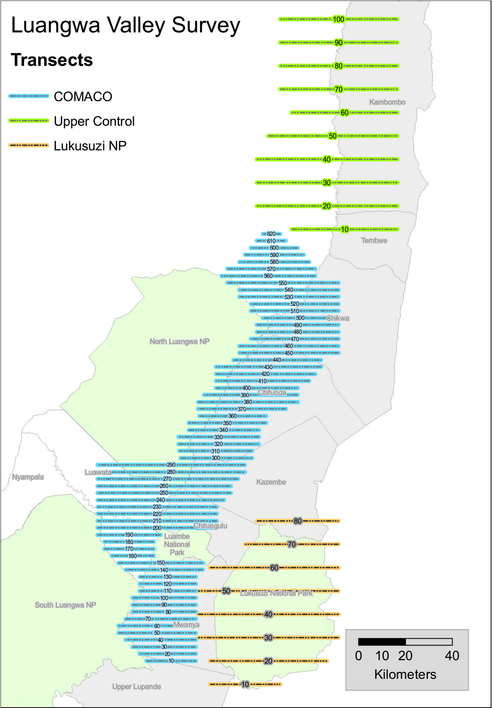

Figure 13: Transect lines, Luangwa Valley 2008.

This is an example of a stratified survey: high-density areas (blue
lines) were flown at a higher intensity than the other two zones, and
estimates were produced separately.

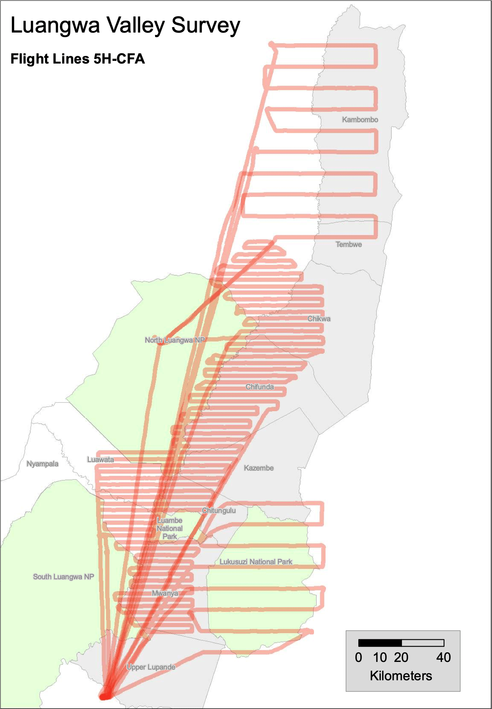

Figure 14: Actual flight paths, Luangwa Valley 2008.

Note the two field bases in use: one in the south where most of the
flight lines converge, and one in the north with close access to some of
the northern transects.

Counting Photographs
--------------------

With digital photography, it has become far easier to immediately
process photographic data – it can, and should, be done immediately
after the survey flight.

The process: download from the camera to a folder on the computer;
geo-reference photographs if required; allocate frame numbers to
individual observations based on sequence/time and the number of frames
indicated by RSOs, and write the frame numbers on the data sheet; open
the photograph in a graphic package such as Photoshop or GIMP; enhance
the photo as necessary; count the number of animals seen and place dots
on each as part of the counting process; save the counted (dotted)
picture in the same folder as the original.

**Downloading**

This is dependent on the model of camera. Typically, however:

1. Connect the camera (or card) to the computer with a USB cable;

44. Open the folder on the camera to see the images;

45. Select the set of images from the camera folder (it may help to
    change the view to “details” and sort by date – then, select the set
    of photos from the appropriate start time to the end) and ‘copy’.

46. Create a folder for the photographs – suggested format
    YEAR-MONTH-DAY SESSION AIRCRAFT POSITION, i.e. “\ **2011-03-20 AM
    5H-CFA Right**\ ”, and paste the photographs into that folder.

**Georeference**: this is optional. Use the GPS track and the
photographs to determine the approximate GPS location of each
photograph. There are numerous software packages for this and you will
need to consult the directions for the package you are using.

**Allocate photographs to their observations**

47. Open the spreadsheet with your observations listed.

48. For each observation where the RSO or FSO indicates a photo was
    taken, look at the number of frames and then indicate the frame
    numbers (i.e. DSC_1002 or whatever filename is used):

    a. If there is a waypoint indicated, check the time of the waypoint
       and match this to the time taken;

    b. If there is no waypoint, use the sequence of images and the
       start/stop time of each transect to determine the correct images.

49. Briefly examine each photograph to see if it belongs with the others
    in its set, and if the species is correct.

**Enhance and count photos**

1. Open the photograph in Adobe Photoshop or GIMP

50. Apply ‘auto levels’ settings (**Ctrl-Shift-L** in Photoshop and
    GIMP)

51. For multiple images of the same herd, identify zones to count

    a. Open all images for the set;

    b. Examine each image and find the parts of the herd that are the
       clearest in each photo, or most central.

    c. Using a brush or pencil tool, draw zones around the set of
       animals that you will count in each photo – then review to ensure
       you have the complete herd covered, photo by photo!

52. Count:

    a. Select the ‘brush’ tool and a contrasting colour (red or green
       depending on background), and place a dot on the back of each
       animal that you count.

    b. As you finish each group of animals, circle them with the brush
       tool and write the total of each group inside the circle.

53. **File: Save As** and add the words “COUNTED” to the filename,
    saving it back to the same folder as the original!

54. Total the number from each photograph and update your spreadsheet.

Setting up a camera for fieldwork
---------------------------------

Setting up a camera for aerial photography is substantially different to
setting it up for regular photography: you are concerned only with
photos of objects at a distance, and for shutter speeds to be fast
enough to avoid any motion blur from a moving aircraft.

The cameras used in most field science applications these days are
digital. The minimum standards are:

-  6 megapixels or better (almost all cameras will have 10 megapixel
   resolution or better);

-  Lens capable of fixed focus, 28 or 35 mm fixed focal length is best,
   but a zoom (i.e. 18-50mm) is acceptable. The exact fixed focal length
   will depend on the type of sensor in the camera – most cameras will
   need a 28mm lens to get a wide enough angle to cover the streamers
   plus a small margin.

-  SLR model with instant response when the shutter is released – many
   cheaper cameras (point-and-shoot types) do *not* do this, and there
   is a delay between pressing the shutter release and the taking of the
   photo; even a quarter-second delay is enough to miss a shot.

The instructions here are generic, and the specific method to set up the
camera will depend on the model you have.

1. Set the lens to fixed focus and zoom

   a. If the lens is a zoom lens, choose a zoom level that you will be
      using in the air – probably around 28 or 35 mm. Tape the zoom ring
      on the lens so that it cannot be moved easily.

   b. With the camera on autofocus, point the lens at a distant object
      (at least 200m away) and lightly press the shutter release to make
      it focus.

   c. Tape the focus ring in place.

   d. Change the camera setting to manual focus.

2. Set the ISO (speed) rating to 400.

3. Set the mode to *aperture priority* and set the aperture number to
   the smallest number available – i.e. 2.8 or 3.6, but NOT 22 or 32
   (the wrong side of the scale!). This means that the camera will use
   the fastest shutter speed possible with the lens set to ‘wide open’.

4. Ensure that the ‘quality’ setting is at its highest. This (depending
   on camera model) will be called “best” or “fine” or “superfine” ...
   this requires that you read the manual to make sure you have the
   right setting!

5. Set the date and time to the local time – check the GPS readings. Do
   this BEFORE you start the survey!

6. Take a photograph of a GPS that is showing the current time – this
   will be a record of the exact difference between the GPS time and the
   internal clock of the camera; this is used to georeference
   photographs later. This photo should be stored with the digital
   pictures as part of the permanent record.

Tips

-  Use plain electrical tape to tape the zoom and focus rings on the
   lens – this should already be part of your kit. Electrical tape
   usually can be placed and removed with a minimum of trouble and it
   leaves little residue. Duct tape does not – it has much stronger glue
   which makes it difficult to remove!

-  Take test photos during your training flights and review them on a
   laptop after landing – do not trust the appearance of the photos on
   the camera screen!

Management of GPS route and waypoint in the field
-------------------------------------------------

On a daily or per-session basis, data are uploaded and downloaded from
GPSs and saved. Before flights, the pilot GPS should have the transect
and route information uploaded, and the FSO GPS should have transect and
subunit information. After the flight, track and waypoint data are
downloaded from each GPS and saved. Old track data are kept on an
archive on the GPS, and old block data are deleted when a new block is
started.

The following are general instructions for a typical survey where block
data are organised into sets for pilot and FSO GPSs:

.. _introduction-1:

Introduction
~~~~~~~~~~~~

Each block has its own set of waypoints and routes for navigation.

-  The pilot’s GPS (g296) will need the waypoints for the transect
      endpoints; the FSO GPS will need the full set of subunits and
      endpoints.

-  Both GPS’s will need the same route loaded; it is OK if only the
      pilot GPS has the route, though.

Erase previous block data:
~~~~~~~~~~~~~~~~~~~~~~~~~~

Pilot GPS
^^^^^^^^^

This is usually a Garmin 296 or equivalent.

Erase only waypoints and routes, not the track:

1. Turn on / enter simulator

2. [Menu] [Menu] then select Points

3. [Menu], select Delete by Symbol

4. Select City (Medium) then [Enter] then select OK to delete waypoints.

5. It will ask you if want to delete route points as well – OK

Use GPS Utility to transfer the blocks:

1. Attach GPS and start GPS Utility

2. Load the block endpoints: “BLOCK transects.txt” (e.g. Ngoma
      transects.txt)

3. Confirm on the map – waypoints and route OK?

4. Upload to GPS – waypoints & routes only.

5. Check on GPS map page.

6. Turn GPS off.

Garmin 60Csx
^^^^^^^^^^^^

Erase waypoints, routes & track:

1. Turn on GPS, turn off reception to save battery (**Menu** at first
      satellite page then **Use with GPS off**;

2. [Menu] [Menu] then select Tracks

3. Select Clear, [Enter] and confirm [Enter].

4. [Find], select Waypoints then [Enter].

5. [Menu], select Delete [Enter].

6. Select City (Medium)

7. Confirm (Yes) [Enter].

Use GPS Utility or GPSBabel to transfer the blocks:

1. Attach GPS and start the application;

2. Load the block endpoints: “BLOCK subunits.gpx”

3. If using GPS Utility, confirm on the map page – waypoints and route
      look OK?

4. Upload to GPS – waypoints & routes only.

Forms & Checklists
------------------

The forms listed here are all available for download in PDF format on
the “Counting Animals” website.

Master Equipment Checklist
~~~~~~~~~~~~~~~~~~~~~~~~~~

The following list is a general checklist for aerial surveys. (The
‘calibration’ section is only required for SRF).

Calibration kit:

-  Streamer / rod kits for aircraft. Confirm *left* and *right* clamps –
   they are different!

-  Small builder’s level.

-  Screwdrivers x 2 (flat head and Phillips).

-  Pliers.

-  Electrical tape – red and black.

-  10m measuring tape for rod distance and eye height.

-  50m measuring tape for markers.

Survey kit

-  forms for FSO, RSO.

-  Pencils and erasers for data entry.

-  Tape recorders: two per aircraft, with one spare.

GPS units

-  Pilot: will probably provide but CHECK before leaving base!

-  FSO

-  One spare for each survey.

-  2 x data cables for download.

Batteries

-  Sufficient AA or, ideally, rechargeable units, for an entire survey.
   GPS60Csx handhelds can go through a set of alkaline batteries in a
   day – but TEST this at home because battery quality and GPS power
   drain varies considerably!

Emergency kit for aircraft + first aid.

Photographic kit for each plane:

-  Cameras (2/plane) w/ 28 or 35mm fixed lenses.

-  Battery chargers for cameras.

-  Cable releases – two per plane, plus two spare (these are easily
   damaged).

-  Stickypod mounting kits.

Airsickness bags

Crew instruction sheets for FSO, RSO and pilot:

-  print out this manual for trainees, or the relevant sections for
   experienced staff.

Office kit:

-  Data forms: this depends on the length of the transects, but
   typically 1 FSO sheet per transect and 2 RSO.

-  Clipboards: one per plane.

-  Box file to file survey data as it is filled in.

-  Pencils

-  Erasers

-  Sharpeners

Topographic map of the entire survey region.

UWA Forms
~~~~~~~~~

The following pages are the FSO and RSO forms used by the Uganda
Wildlife Authority in their survey programme.

FSO DATA SHEET

============= ========== ===========
**Aircraft:** **FSO:**   **Survey:**
============= ========== ===========
\             **Pilot:** **Date:**
============= ========== ===========

+---------+---------+---------+---------+---------+---------+---------+
| **Tra   | **Su    | *       | *       | *       | *       | *       |
| nsect** | bunit** | *Height | *Height | *Height | *Height | *Height |
|         |         | 1**     | 2**     | 3**     | 4**     | 5**     |
+---------+---------+---------+---------+---------+---------+---------+
|         |         |         |         |         |         |         |
+---------+---------+---------+---------+---------+---------+---------+
|         |         |         |         |         |         |         |
+---------+---------+---------+---------+---------+---------+---------+
|         |         |         |         |         |         |         |
+---------+---------+---------+---------+---------+---------+---------+
|         |         |         |         |         |         |         |
+---------+---------+---------+---------+---------+---------+---------+
|         |         |         |         |         |         |         |
+---------+---------+---------+---------+---------+---------+---------+
|         |         |         |         |         |         |         |
+---------+---------+---------+---------+---------+---------+---------+
|         |         |         |         |         |         |         |
+---------+---------+---------+---------+---------+---------+---------+
|         |         |         |         |         |         |         |
+---------+---------+---------+---------+---------+---------+---------+
|         |         |         |         |         |         |         |
+---------+---------+---------+---------+---------+---------+---------+
|         |         |         |         |         |         |         |
+---------+---------+---------+---------+---------+---------+---------+
|         |         |         |         |         |         |         |
+---------+---------+---------+---------+---------+---------+---------+
|         |         |         |         |         |         |         |
+---------+---------+---------+---------+---------+---------+---------+
|         |         |         |         |         |         |         |
+---------+---------+---------+---------+---------+---------+---------+
|         |         |         |         |         |         |         |
+---------+---------+---------+---------+---------+---------+---------+
|         |         |         |         |         |         |         |
+---------+---------+---------+---------+---------+---------+---------+
|         |         |         |         |         |         |         |
+---------+---------+---------+---------+---------+---------+---------+
|         |         |         |         |         |         |         |
+---------+---------+---------+---------+---------+---------+---------+
|         |         |         |         |         |         |         |
+---------+---------+---------+---------+---------+---------+---------+
|         |         |         |         |         |         |         |
+---------+---------+---------+---------+---------+---------+---------+
|         |         |         |         |         |         |         |
+---------+---------+---------+---------+---------+---------+---------+
|         |         |         |         |         |         |         |
+---------+---------+---------+---------+---------+---------+---------+
|         |         |         |         |         |         |         |
+---------+---------+---------+---------+---------+---------+---------+
|         |         |         |         |         |         |         |
+---------+---------+---------+---------+---------+---------+---------+
|         |         |         |         |         |         |         |
+---------+---------+---------+---------+---------+---------+---------+
|         |         |         |         |         |         |         |
+---------+---------+---------+---------+---------+---------+---------+
|         |         |         |         |         |         |         |
+---------+---------+---------+---------+---------+---------+---------+
|         |         |         |         |         |         |         |
+---------+---------+---------+---------+---------+---------+---------+
|         |         |         |         |         |         |         |
+---------+---------+---------+---------+---------+---------+---------+
|         |         |         |         |         |         |         |
+---------+---------+---------+---------+---------+---------+---------+
|         |         |         |         |         |         |         |
+---------+---------+---------+---------+---------+---------+---------+
|         |         |         |         |         |         |         |
+---------+---------+---------+---------+---------+---------+---------+
|         |         |         |         |         |         |         |
+---------+---------+---------+---------+---------+---------+---------+
|         |         |         |         |         |         |         |
+---------+---------+---------+---------+---------+---------+---------+
|         |         |         |         |         |         |         |
+---------+---------+---------+---------+---------+---------+---------+
|         |         |         |         |         |         |         |
+---------+---------+---------+---------+---------+---------+---------+
|         |         |         |         |         |         |         |
+---------+---------+---------+---------+---------+---------+---------+
|         |         |         |         |         |         |         |
+---------+---------+---------+---------+---------+---------+---------+
|         |         |         |         |         |         |         |
+---------+---------+---------+---------+---------+---------+---------+

**
**

**RSO DATA SHEET**

============= ======================= ===========
**Aircraft:** **RSO Position: R / L** **Survey:**
============= ======================= ===========
\             **Initials:**           **Date:**
============= ======================= ===========

+---------+---------+---------+---------+---------+---------+---------+
| **Tra   | **Su    | **Sp    | **Est   | **No.   | **Photo | **Com   |
| nsect** | bunit** | ecies** | imate** | P       | Est     | ments** |
|         |         |         |         | hotos** | imate** |         |
+---------+---------+---------+---------+---------+---------+---------+
|         |         |         |         |         |         |         |
+---------+---------+---------+---------+---------+---------+---------+
|         |         |         |         |         |         |         |
+---------+---------+---------+---------+---------+---------+---------+
|         |         |         |         |         |         |         |
+---------+---------+---------+---------+---------+---------+---------+
|         |         |         |         |         |         |         |
+---------+---------+---------+---------+---------+---------+---------+
|         |         |         |         |         |         |         |
+---------+---------+---------+---------+---------+---------+---------+
|         |         |         |         |         |         |         |
+---------+---------+---------+---------+---------+---------+---------+
|         |         |         |         |         |         |         |
+---------+---------+---------+---------+---------+---------+---------+
|         |         |         |         |         |         |         |
+---------+---------+---------+---------+---------+---------+---------+
|         |         |         |         |         |         |         |
+---------+---------+---------+---------+---------+---------+---------+
|         |         |         |         |         |         |         |
+---------+---------+---------+---------+---------+---------+---------+
|         |         |         |         |         |         |         |
+---------+---------+---------+---------+---------+---------+---------+
|         |         |         |         |         |         |         |
+---------+---------+---------+---------+---------+---------+---------+
|         |         |         |         |         |         |         |
+---------+---------+---------+---------+---------+---------+---------+
|         |         |         |         |         |         |         |
+---------+---------+---------+---------+---------+---------+---------+
|         |         |         |         |         |         |         |
+---------+---------+---------+---------+---------+---------+---------+
|         |         |         |         |         |         |         |
+---------+---------+---------+---------+---------+---------+---------+
|         |         |         |         |         |         |         |
+---------+---------+---------+---------+---------+---------+---------+
|         |         |         |         |         |         |         |
+---------+---------+---------+---------+---------+---------+---------+
|         |         |         |         |         |         |         |
+---------+---------+---------+---------+---------+---------+---------+
|         |         |         |         |         |         |         |
+---------+---------+---------+---------+---------+---------+---------+
|         |         |         |         |         |         |         |
+---------+---------+---------+---------+---------+---------+---------+
|         |         |         |         |         |         |         |
+---------+---------+---------+---------+---------+---------+---------+
|         |         |         |         |         |         |         |
+---------+---------+---------+---------+---------+---------+---------+
|         |         |         |         |         |         |         |
+---------+---------+---------+---------+---------+---------+---------+
|         |         |         |         |         |         |         |
+---------+---------+---------+---------+---------+---------+---------+
|         |         |         |         |         |         |         |
+---------+---------+---------+---------+---------+---------+---------+
|         |         |         |         |         |         |         |
+---------+---------+---------+---------+---------+---------+---------+
|         |         |         |         |         |         |         |
+---------+---------+---------+---------+---------+---------+---------+
|         |         |         |         |         |         |         |
+---------+---------+---------+---------+---------+---------+---------+
|         |         |         |         |         |         |         |
+---------+---------+---------+---------+---------+---------+---------+
|         |         |         |         |         |         |         |
+---------+---------+---------+---------+---------+---------+---------+
|         |         |         |         |         |         |         |
+---------+---------+---------+---------+---------+---------+---------+
|         |         |         |         |         |         |         |
+---------+---------+---------+---------+---------+---------+---------+
|         |         |         |         |         |         |         |
+---------+---------+---------+---------+---------+---------+---------+
|         |         |         |         |         |         |         |
+---------+---------+---------+---------+---------+---------+---------+
|         |         |         |         |         |         |         |
+---------+---------+---------+---------+---------+---------+---------+
|         |         |         |         |         |         |         |
+---------+---------+---------+---------+---------+---------+---------+
|         |         |         |         |         |         |         |
+---------+---------+---------+---------+---------+---------+---------+
|         |         |         |         |         |         |         |
+---------+---------+---------+---------+---------+---------+---------+
|         |         |         |         |         |         |         |
+---------+---------+---------+---------+---------+---------+---------+

.. [1]
   The estimate would have been greatly increased – three small groups
   were actually within transects, but just one larger group would
   probably have increased the observations by twenty times or more –
   e.g. estimate of 30 vs. estimate of 500.

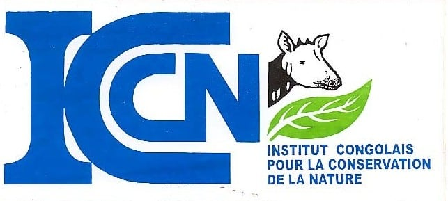
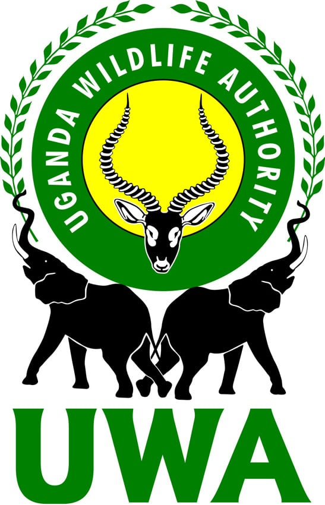
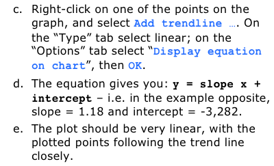
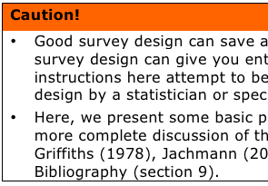
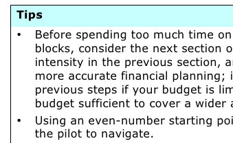

.. |image6| image:: import/media/image15.png
   :width: 0.17385in
   :height: 0.16806in
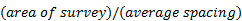

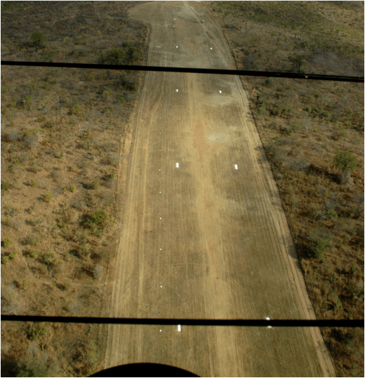
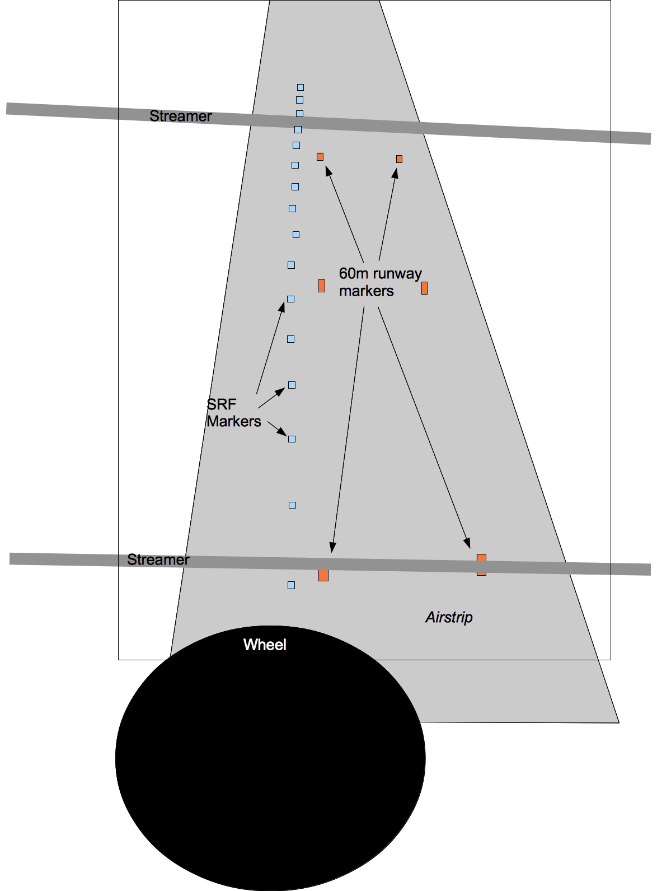
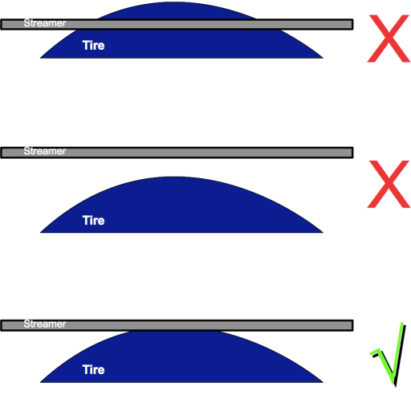
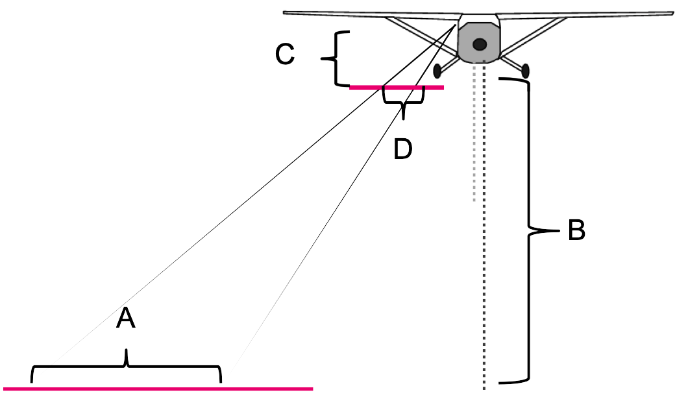
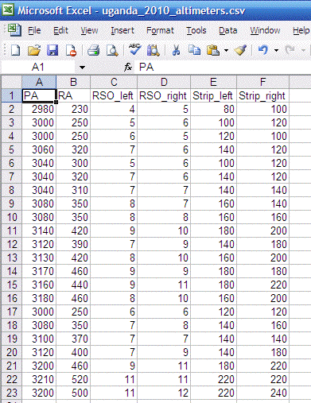
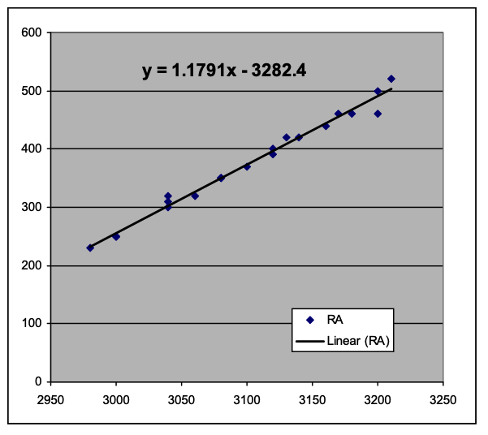
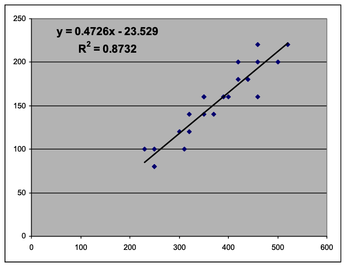

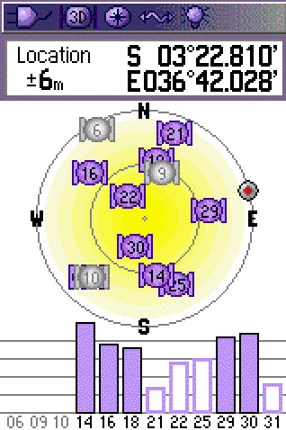
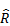

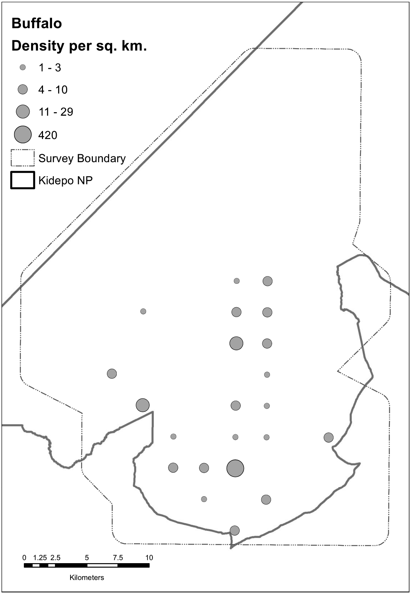
